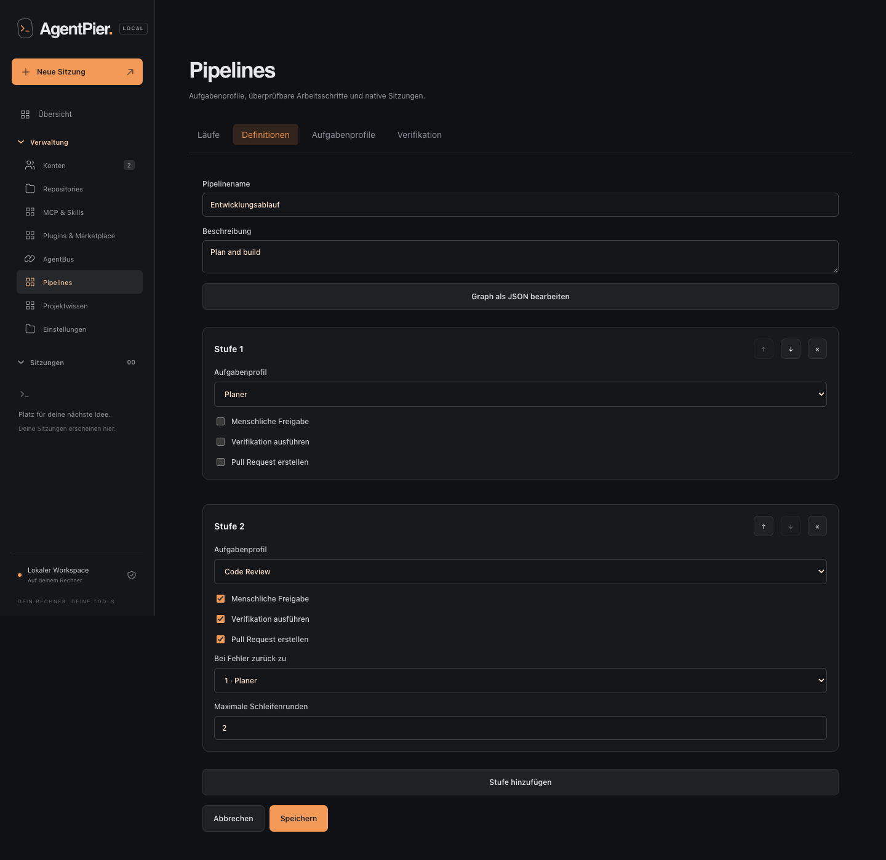

# AgentPier

**Your coding CLIs, connected — from desktop to mobile.**

AgentPier is a self-hosted workspace for Codex, Claude Code and OpenCode. Use their
native terminals, continue conversations from your phone, and run implementation,
review and verification through reusable pipelines.

[Deutsch](README.de.md) · [Contributing](CONTRIBUTING.md) · [Security](SECURITY.md) ·
[Apache-2.0](LICENSE)

## Why AgentPier?

- **Pipelines with review:** reusable CLI profiles, isolated Git worktrees,
  bounded review loops, automated checks, human approval, diffs and artifacts.
- **Native CLI sessions:** real tmux-backed terminals with the CLI's own login,
  models and supported permission prompts. Chat messages enter that same session.
- **Mobile chat that recovers:** immediate delivery status, persistent drafts,
  reconnecting terminals and incremental history updates when you return.
- **Files and images:** drag files into desktop chat or terminal, upload, preview
  and retry individual files; recover
  interrupted uploads after a reload without automatically sending them again.
- **Multiple accounts and providers:** separate credentials, host-scoped GitHub
  access, and shared CLI skills, MCP integrations and plugins.
- **Session SSH access:** name and reuse SSH keys across hosts, and assign accesses
  to new or running sessions, with pinned host keys and explicit connection commands.
- **AgentBus:** bundled coordination between participating coding sessions in
  the same project.



## Quick start

Use macOS or Linux with **Node.js 22.13+**, **Git** and **tmux**. Install at least
one supported coding CLI, or use AgentPier's CLI installer after starting it.
Provider accounts and any associated usage costs remain your responsibility.

```sh
git clone https://github.com/Ranger-Marketing-Vertriebs-GmbH/agent-pier.git
cd agent-pier
npm ci
npm run build
npm start
```

Open **http://127.0.0.1:4380** and create the initial user. Subsequent visits require
login. Setup is available through configured permitted network access as well;
it is not restricted to the local computer. Complete initial setup before sharing
access. See [login](docs/login.md) and [remote access](docs/remote-access.md).

Choose a CLI, account and project folder, then start a session. The native terminal
handles CLI login and menus; the chat view shows saved conversation history.
The interface currently uses German labels.

Stopping the web server leaves native CLI sessions running. Stop a session in the
interface when you want to terminate that CLI process.

## From one session to a reviewed pipeline

Register a project, define profiles for implementation and review, and choose a
pipeline template. Each run uses its own Git worktree. Checks and review feedback
can send a stage through a bounded repair loop; approval and cleanup are deliberate
actions. Open the stages' normal chat or terminal views to inspect their work.

Read the [pipeline guide](docs/pipelines.md) for lifecycle and recovery details.

## Installation and operation

| Task                                  | Guide                                                 |
| ------------------------------------- | ----------------------------------------------------- |
| macOS / Mac mini installation         | [Installation](docs/installation.md)                  |
| Linux and systemd                     | [Linux](docs/linux.md)                                |
| Private remote access                 | [Remote access](docs/remote-access.md)                |
| SSH server accesses                   | [SSH access](docs/ssh-access.md)                      |
| Login and user recovery               | [Login](docs/login.md)                                |
| Delivery status and draft recovery    | [Mobile delivery](docs/mobile-delivery.md)            |
| Terminal, chat and upload recovery    | [Mobile recovery](docs/mobile-recovery.md)            |
| Backups, release packages and updates | [Operations](docs/research/operations-portability.md) |
| All features, in German               | [German guide](README.de.md)                          |

Versioned packages include their own Node runtime. Source installation remains
available using the commands above. Follow the release and installation guides
for available platforms and explicit service setup.

## Data and boundaries

AgentPier runs on your machine. Runtime data defaults to `.data/` and includes
credentials, account profiles, session metadata and saved conversations. These
files are excluded from Git and use private filesystem permissions; they are not
automatically encrypted at rest.

The login protects the web workspace. Native CLIs still run as the server's OS
user, and their own permissions determine what they may access. Treat AgentPier
as a trusted personal workspace, not as an isolation boundary for mutually
untrusted users. Provider requests still go to the services configured in the CLI.

The chat reader reflects saved native history rather than character-by-character
terminal output. Supported model menus, tasks and approval prompts depend on the
installed CLI version. The native terminal remains available when a structured
integration cannot represent a prompt. Receipt status confirms handoff to the CLI;
it does not claim that the model has already started processing the message.

## Development and contributions

```sh
npm ci
npm run check
npx playwright install chromium webkit
npm run test:e2e
AGENTPIER_TEST_BROWSER=webkit npm run test:e2e
```

For frontend development, run `npm start` for the backend and `npm run dev` in a
second terminal. Vite proxies `/api` and `/auth` to the backend.

Bug reports, documentation improvements and focused pull requests are welcome.
Start with [CONTRIBUTING.md](CONTRIBUTING.md), the [testing guide](docs/testing.md)
and the [frontend architecture](web/README.md). Report vulnerabilities privately
using [SECURITY.md](SECURITY.md).

## License

AgentPier is licensed under [Apache-2.0](LICENSE). Bundled AgentBus retains its
[MIT license](vendor/agentbus/LICENSE). Dependencies and provider marks retain
their respective notices and rights; see [third-party notices](THIRD_PARTY_NOTICES.md).
