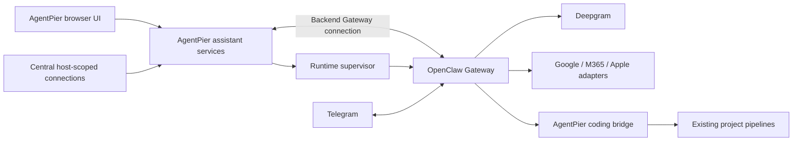
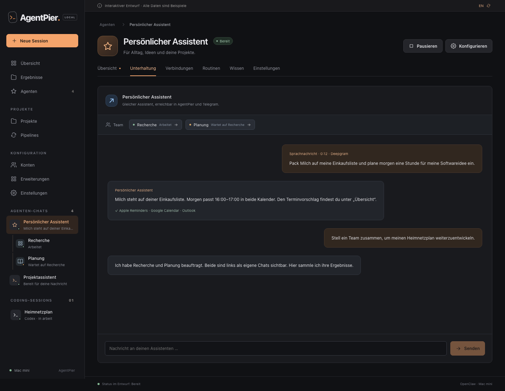
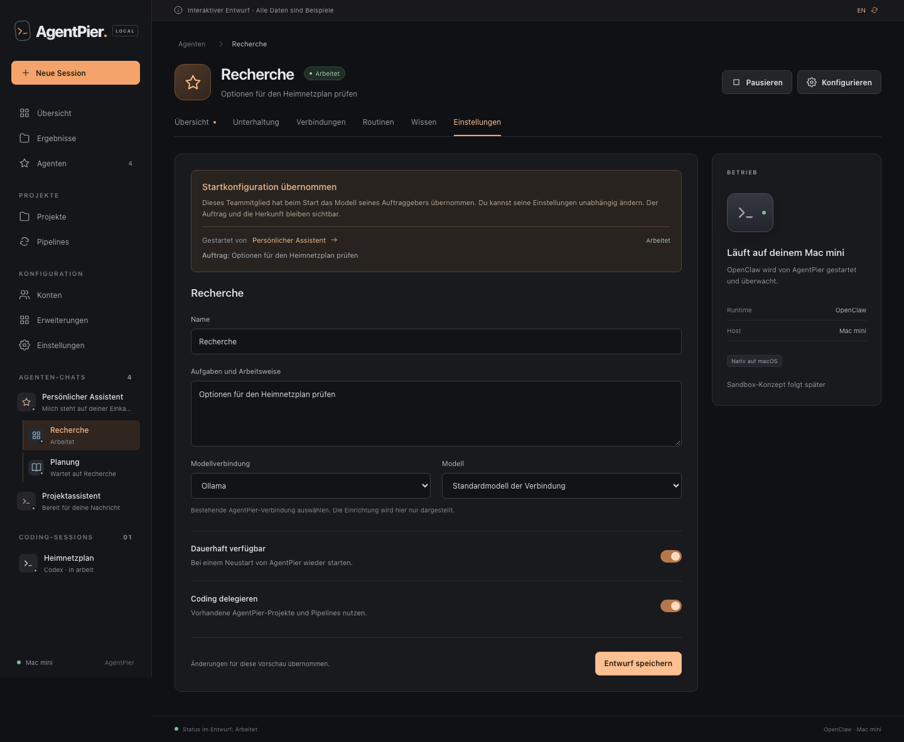

# Managed OpenClaw assistants and visible agent teams

---

Status: proposed for review; product direction agreed, implementation not started

Date: 2026-10-07

---

## Context

AgentPier currently hosts native coding CLI sessions. Its persistent host process,
model connections, projects and pipeline tools also provide a useful home for
personal assistants that remain available between conversations. The intended
workloads include planning software, maintaining project or home-network notes,
monitoring mail, coordinating calendars, remembering tasks, and preparing meal and
shopping plans. Assistants can delegate coding work to AgentPier.

The initial communication channel is Telegram, including voice messages transcribed
with Deepgram. Required service integrations are Gmail, Google Calendar, Microsoft
365 Calendar and native Apple Reminders. The first personal deployment runs on
macOS; AgentPier's macOS/Linux support must remain intact and Apple-specific
features must be represented as platform-dependent capabilities.

A disposable [runtime spike](../research/openclaw-runtime-spike.md) verified basic
OpenClaw process, configuration and conversation control. An interactive mockup
established a more specific UX requirement: agent conversations must be accessible
as directly as coding sessions, including conversations with dynamically created
team members. A management directory alone is insufficient.

This ADR records the subsystem boundaries and product invariants. It is not an
executable implementation plan. Open decision points below remain explicit rather
than becoming accidental defaults during implementation.

## Decision

Use a version-pinned OpenClaw Gateway as a native background process managed by
AgentPier. Present an AgentPier-native UI and control it through the AgentPier
backend. Keep OpenClaw as an external runtime behind an adapter; do not fork it or
embed its dashboard as the main product interface.

One managed runtime per AgentPier host is the initial topology, serving multiple
assistant definitions and their teams. The initial ownership model is the existing
host/workspace owner, not a new multi-tenant service. Connecting an existing,
independently managed OpenClaw installation is a later extension, not an implicit
migration or takeover.

### 1. Direct conversations and management

- Add an **Agents** management entry for creating and configuring assistants.
- Put **Agent chats** in the sidebar alongside coding sessions. Selecting an entry
  opens its conversation directly, without going through a directory or overview.
- Show generated team members beneath their assigning agent, with name, task and
  observed status. They must appear whether creation follows a direct user request
  or an agent's permitted autonomous decision.
- Give each member a directly accessible conversation and settings. Expose the
  parent/task relationship in the chat; do not hide delegation behind a generic
  activity indicator.
- Keep per-agent settings reachable from its chat header. Connections, routines,
  knowledge and activity can remain secondary detail views.
- Preserve selected conversation in the URL and retain drafts across navigation.
  Use the same direct navigation principle on mobile.
- Report observed states such as working, waiting, completed, failed and unknown.
  Model configuration is not evidence that an agent is currently running.

These images are design studies with synthetic data, not implemented application
screens. Sidebar hierarchy is a projection of runtime relationships, not proof of
filesystem or operating-system isolation.

### 2. Assistant, team member, conversation and run are distinct

The integration maintains stable AgentPier IDs and external-runtime mappings:

| Concept              | Responsibility                                                                                         |
| -------------------- | ------------------------------------------------------------------------------------------------------ |
| Assistant definition | Durable name, instructions, model reference, service references, routines and behavior preferences     |
| Team/task identity   | Groups one delegation objective and its members; records creator and authorization provenance          |
| Team member          | A visible participant created for an assignment, with its own conversation and effective configuration |
| Conversation         | Maps a direct chat or channel thread to a runtime session key; owns navigation and delivery routing    |
| Run                  | One execution attempt with a runtime run ID and terminal outcome                                       |
| Coding delegation    | Links a team/task to an existing AgentPier pipeline run or coding session                              |

A runtime subagent session is not necessarily a durable OpenClaw agent definition.
The adapter must discover and correlate the actual runtime objects; do not create a
permanent assistant definition for every transient model turn. Conversely, every
user-relevant delegated participant must receive an AgentPier identity and visible
chat entry. Replayed spawn events must not create duplicate entries.

The [permanent-agent spike](../research/openclaw-permanent-agent-spike.md) verified
model-created persistent conversations through `sessions_spawn` with `visible: true`,
and separately verified durable profiles through the backend `agents.create` API.
Both survived a graceful Gateway restart. A spawn selects an existing profile; a
permanent colleague with a new profile therefore needs an AgentPier provisioning
bridge. Separate Gateway processes also worked, but native spawning did not create
or federate them. Keep that deployment option outside the initial topology.

Use stable parent/creator IDs, task IDs, session keys, run IDs and idempotency keys.
Keep enough durable mapping to reconcile the hierarchy after either process
restarts. Reconcile history and current runs when events are missed; do not assume
an event stream replays every missed frame or that an accepted send is completion.

The same assistant may be available in AgentPier and Telegram. Shared identity and
knowledge do not imply a single shared transcript. Explicitly map channel owner,
chat/thread and assistant conversation so replies and notifications return to the
correct destination. This mapping must be tested before claiming cross-channel
continuity.

### 3. Generated members receive their own configuration

When a member is created, snapshot the selected parent configuration revision and
resolve a concrete effective model selection. Give it a distinct assignment and
record its creator. Preserve the source of each effective value: inherited at
creation, explicitly assigned for the task, or overridden for the member.

The user can inspect and change the member's settings independently. Later parent
edits do not silently rewrite an existing member's settings. Changes during a run
must distinguish saved desired configuration from the currently executing
configuration; applying at a safe turn boundary or through an explicit restart
must be observable.

Model/provider defaults may be copied as references. Service and project access
must be explicitly assigned from available host-scoped connections for the task;
copying model defaults must not silently copy every credential or grant. Central
credentials are not duplicated into browser-visible assistant records.

The team-creation policy is independent from operating-system sandboxing. It must
support a direct user authorization for one assignment and a configurable
per-assistant preference for autonomous team creation. By default, an assistant
must ask before creating a team on its own. The user can enable standing permission
per assistant. An explicit instruction to form a team authorizes creation for that
assignment without another confirmation; it does not change the standing preference.
This default was confirmed by the user on 2026-10-07.

### 4. Lifecycle and delegation behavior

Creation, readiness, execution, completion, stopping, archiving and deletion are
separate operations. Preserve completed or failed conversations for inspection;
completion alone must not make a team member disappear from navigation. The exact
retention and archival policy is a follow-up decision.

Stopping one member and stopping a whole team must be distinguishable. A request
to stop is pending until the runtime confirms a terminal state. The parent sees
individual results/failures and can report a coherent task outcome. A member's
failure must not be presented as success for the whole task.

Bound team size, parallel execution and recursion through explicit configurable
limits. Show a useful outcome when a limit is reached. Numeric defaults, whether
members may delegate again, and how task-bound agents can become durable
assistants require a focused lifecycle decision before team execution ships.

Use the existing AgentPier pipeline APIs for the first coding bridge:
`run_start`, `run_get`, `run_cancel` and artifact/result tools. Preserve request IDs
for retries and link back to the owning assistant, conversation and task. Existing
human gates remain human gates. The current MCP surface has no general raw
`session_create`; ad hoc coding-session creation needs a separate supported
interface if later required.

### 5. Configuration and credential ownership

AgentPier owns user-facing assistant definitions, connection references, desired
configuration revisions and runtime lifecycle. OpenClaw owns its internal session,
transcript and runtime state. Do not edit undocumented transcript/state files to
simulate Gateway operations.

The adapter reads the current configuration and authored revision, then applies
narrow patches with conflict detection. Preserve fields AgentPier does not own and
allow OpenClaw to canonicalize its schema. Read back the effective state. Surface
validation errors, pending application, restart requirements and version mismatch
as distinct conditions.

Keep the Gateway token and provider credentials in the backend. Browsers receive
opaque connection IDs and availability metadata. In the tested runtime, a holder
of the shared Gateway token can request an administrative connection; requesting
read-only scopes is not a substitute for keeping that token private.

ChatGPT/Codex authentication, API-key providers, OpenRouter, Ollama, llama.cpp and
custom endpoints are separate adapter capabilities. A provider appearing in the
mockup is not proof of working authentication or tool calls. Preserve existing
AgentPier account isolation; validate login, refresh, model selection and protocol
compatibility instead of copying native CLI credentials indiscriminately.

### 6. Channels, speech, knowledge and services

| Area            | Chosen direction                                                  | Required validation/integration                                                             |
| --------------- | ----------------------------------------------------------------- | ------------------------------------------------------------------------------------------- |
| Telegram        | First text and voice channel                                      | Owner pairing, bot/thread routing, replay/deduplication, reconnect and delivery status      |
| Deepgram        | First STT provider, configured centrally in AgentPier             | Shared credential reference, model/language settings, audio limits and error/retry behavior |
| Gmail           | Read/monitor messages and react to relevant events                | OAuth scopes, watch setup/renewal, event reachability and duplicate events                  |
| Google Calendar | Personal calendar integration                                     | Calendar selection, read/write behavior, timezone and conflicts                             |
| M365 Calendar   | Graph-backed or vetted MCP adapter                                | Actual tenant login, consent, refresh, calendar selection and notifications                 |
| Apple Reminders | Native macOS integration, initially evaluating remindctl/EventKit | Permission under the actual background-service identity; synced lists and reminders         |
| Knowledge       | Durable per-assistant/project context with inspectable provenance | Editing, retrieval, deletion and behavior after a model change                              |
| Routines        | Scheduled and event-driven work                                   | Durable schedules, timezone/DST, missed events, retry and delivery semantics                |

Deepgram remains a shared AgentPier setting, not a key entered independently for
every bot. The first adapter may supply that configuration to OpenClaw's existing
Deepgram capability; a separate AgentPier audio service is not required solely for
this integration. Sending voice notes must not depend on ChatGPT subscription
support for transcription.

Personal knowledge is conceptually separate from existing repository memory.
Reuse shared project knowledge through explicit integration rather than exposing
all repository memories to every assistant. Never promise that model changes
preserve native model context; preserve the stored knowledge and conversation
records that AgentPier/OpenClaw actually own.

### 7. Process management and installation

Launch the Gateway as an owned foreground child with a version-pinned package and
compatible Node runtime. Give it explicit private config, state, workspace and log
paths, a loopback port and an allowlisted environment. Do not install a second
independent daemon or adopt arbitrary processes based on their port alone.

Installation and upgrades for existing installations must provision required
runtime tools. The tested OpenClaw 2026.9.8 package requires
`>=24.16.0 <25 || >=26.1.0`; AgentPier currently accepts Node 22.13+, so relying on the
host's existing Node binary is insufficient. Keep AgentPier's existing supported
runtime contract unless a separate decision changes it.

Wait for authenticated readiness, not merely an open TCP port. Use bounded restart
backoff and expose failures. Reconcile outstanding runs, children and history after
reconnection. Define shutdown and orphan-process behavior using owned process
identity; test both graceful shutdown and abrupt failure. Version upgrades need
schema/protocol compatibility checks, backup and a documented recovery path;
rolling back a package alone may not undo state migrations.

The [status/recovery probe](../research/openclaw-status-recovery-spike.md) verified
reconciliation after a dropped connection and detected an interrupted child after
SIGKILL. Resending that interrupted request could execute it again under the same
runtime run ID. Keep an AgentPier request/action ledger, distinguish wait timeout
from terminal failure, and reconcile external effects before retrying uncertain
work. Native log warnings alone must not determine task status.

The proposed [Gateway design](../assistant-gateway.md) places service operation in
Settings > Assistants > Runtime while preserving direct agent chats. It separates
service availability, status reconciliation, run outcome and external delivery.

OpenClaw's logging path must be set explicitly; isolated HOME/TMPDIR does not by
itself isolate every output. Translate stable browser-visible diagnostics through
AgentPier's DE/EN catalogs while retaining native diagnostic evidence separately.

### 8. Native execution first; sandbox design deferred

The initial topology is native execution on the host. The user explicitly deferred
a concrete sandbox design. Keep tool execution behind a replaceable boundary so a
later sandbox or native host bridge can be introduced without redesigning chats,
assistant identities or central connections.

Action approvals, service access and team autonomy are separate decisions. A
restricted tool list or an instruction to ask before sending mail is not a strong
technical boundary if unrestricted host shell execution can bypass it. This ADR
neither selects mandatory confinement nor claims that profile isolation is an OS
sandbox. It does not change [ADR 0001](0001-optional-per-session-nono-sandbox.md).

## Considered options

- **Own complete assistant runtime:** maximizes control but duplicates channels,
  schedules, memory, tools and agent orchestration before user-facing value.
- **Fork OpenClaw:** adds long-term merge and upgrade work without a demonstrated
  need in the tested Gateway workflows.
- **Embed the OpenClaw dashboard:** reduces UI work but fails the direct-chat and
  unified-settings requirements; runtime details would define AgentPier navigation.
- **Hermes or a smaller framework:** credible alternatives, retained as fallbacks.
  OpenClaw currently has the best demonstrated fit for this scope; the adapter
  boundary limits lock-in without promising trivial runtime replacement.
- **Mandatory sandbox from the outset:** conflicts with the user's decision to
  defer this topic and would expand the spike into host integration design.

## Consequences

AgentPier gains a second execution subsystem in addition to native coding CLIs.
The UI can share navigation, connections and project links while keeping the
runtime's lifecycle and conversation semantics explicit. A single runtime can
host multiple assistants. A deterministic live contract probe verified profile
creation, hidden/visible delegation, parent relationships and graceful restart
persistence. Production reconciliation, active-crash recovery and provisioning
authorization still need qualification before shipping.

There is installation footprint, version/schema churn and operational work beyond
adding a chat page. The pinned spike proves a useful control boundary, not the
entire product. Real accounts, Apple service permissions, voice transcription,
the autonomous profile-provisioning bridge and cross-platform installation remain
unverified.

## Open decisions and delivery gates

1. **Team lifecycle:** retention/archive policy, durable promotion, recursion and
   concrete concurrency/budget limits. Define the explicit choice between a
   task-bound member and provisioning a permanent profile, including authorization.
   Design and test before team execution.
2. **Actions with external effects:** per-service defaults for calendar mutations,
   outgoing messages and mail. The mockup's approval card is illustrative.
3. **Channel identity:** whether a user's Telegram conversation continues a selected
   AgentPier thread or is a separately linked conversation. Never guess routing.
4. **Provider authentication:** supported ChatGPT/Codex login flow and lifecycle;
   local/custom protocol support is gated on actual adapter tests.
5. **Sandbox:** explicitly deferred; not a prerequisite for the initial design.

Create backlog work with acceptance criteria and dependencies in the AgentPier
Plane project. Start with live multi-agent contract validation and managed runtime
foundations, then direct chats/configuration, Telegram/Deepgram, visible teams,
knowledge/routines, service adapters and coding delegation. Implementation tasks
must resolve their relevant open decisions and receive a concrete implementation
plan before product code changes begin.

## References

- [Pinned runtime spike evidence](../research/openclaw-runtime-spike.md)
- [Permanent agents and parallel Gateways](../research/openclaw-permanent-agent-spike.md)
- [Status diagnostics and recovery](../research/openclaw-status-recovery-spike.md)
- [Managed Gateway design](../assistant-gateway.md)
- [OpenClaw embedding](https://docs.openclaw.ai/gateway/embedding)
- [Gateway integrations](https://docs.openclaw.ai/gateway/external-apps)
- [Deepgram provider](https://docs.openclaw.ai/providers/deepgram)
- [remindctl](https://github.com/openclaw/remindctl)
- [AgentPier architecture](../architecture.md)

The repository record contains synthetic screenshots and public technical sources.
Private interactive artifacts and execution planning are linked from the private
Plane work items rather than publishing host URLs or account details here.
