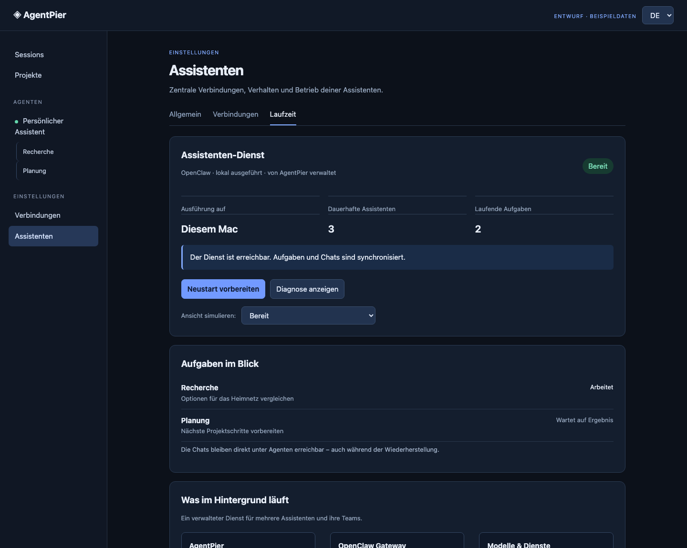
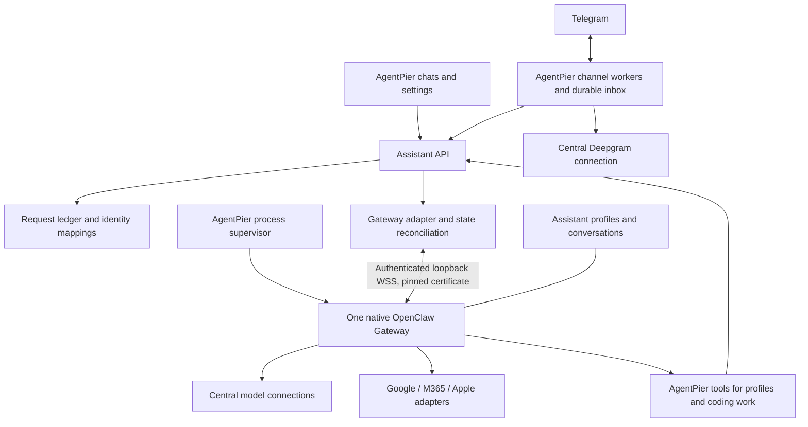

# Managed assistant Gateway design

Status: operating guide for the optional managed agent subsystem. Agents are off
until the owner turns them on; foundation, ChatGPT and provider accounts, Telegram
with Deepgram, visible teams, team coding requests, native memory, reminders and
routines are implemented. Service adapters (Gmail, Microsoft 365, Google Calendar,
Apple) and a sandbox remain deferred. Date: 2026-10-08, updated 2026-10-09.
Companion to [ADR 0002](adr/0002-managed-openclaw-assistants.md) and the
[status/recovery evidence](research/openclaw-status-recovery-spike.md).
Chronological qualification and spike logs live in `docs/research/`:
[team qualification and owner trials](research/openclaw-team-qualification-log.md)
and [native memory and automation spike](research/openclaw-native-memory-automation-spike.md).

## User-facing shape

Agent chats remain directly reachable in the sidebar, with team members nested
under their assigning assistant. The Agents directory manages profiles. Per-agent
settings configure instructions, models, service access and team permission.

Place shared service operation under **Settings > Agents > Agent service**. Call the
main card **Assistant service**; show OpenClaw as its managed runtime, not another
application the user must administer. The card shows readiness, host, active work,
restart preparation and diagnostics. Central model/service connections remain in
AgentPier. Technical details such as protocol, pin and private state locations are
secondary, expandable information; credentials never appear there.

The private interactive study illustrates three states with synthetic data:
ready, reconnecting, and reachable after an interrupted task. Its controls simulate
UI behavior only. DE/EN copy is included; publication does not deploy a service.

## Runtime boundary

AgentPier owns process lifecycle, user authorization, central connection references,
request identities and its UI projection. OpenClaw owns its agent loop, session
internals and model/tool execution. AgentPier owns Telegram transport and speech
transcription. The browser talks only to the
AgentPier backend. No iframe of the upstream dashboard is needed.

One Gateway hosts several assistant profiles and their conversations. A separate
Gateway is a future deployment choice for independent lifecycle/configuration; it
does not automatically form a team with the first instance. Multiple profiles or
processes on the same native host are not an OS sandbox.

## Opt-in switch

Agents are off by default. **Settings > Agents** carries the single switch ("Enable
agents"). While it is off the subsystem is dormant: AgentPier creates no `assistants/`
folder or database, starts no Gateway, poller, scheduler or background loop, installs
or downloads nothing, and shows no agent navigation or account sections. Turning it
on provisions the runtime and starts the service. The choice is stored in
`assistant-feature.json` in the data directory. Installations from before the switch
migrate to enabled when they already ran the runtime or hold a stored agent, so
existing users keep their agents. An unsafe `assistants/` folder (a link, a file, or
another owner) reports `ASSISTANT_STORAGE_UNSAFE` and is never followed or created
over.

## Starting and operating the service

1. Provision the tested package and compatible Node runtime through installation
   and update paths. Keep the runtime pin distinct from AgentPier's own Node support.
2. Allocate private state/config/workspace/log locations, a loopback listener and
   backend-only credentials. Launch an owned foreground child with a narrow env.
3. Wait for authenticated readiness. An open port or live PID alone is insufficient.
   The wait is a wall-clock budget: at least 90 s, or three times the previous
   spawn-to-ready time when that was longer, because a restart also loads the agents
   and sessions created since the first start. A Gateway that exits ends it at once.
4. Reconnect subscriptions and reconcile profile/session/run identities before
   presenting current status. Serve stored history while reconciliation is pending.
5. On unexpected exit, restart with bounded backoff. Preserve state, identify
   interrupted work and expose unresolved outcomes instead of replaying everything.
6. For a planned restart, pause new admission and let current work finish. Coordinate
   Gateway and channel ingress, not just AgentPier's HTTP queue. If work cannot drain
   in time, show the outstanding work and a separate explicit cancellation choice.
7. Keep updates explicit, with compatibility checks and backups. Rolling back a
   package does not necessarily reverse a state migration.

The supervisor, authenticated readiness, bounded restarts and the maintenance gate
are implemented (see below and [runtime updates](assistant-runtime-updates.md)).
Native crash behavior on hosts beyond the qualified ones remains a release gate.

### Gateway transport and authentication

Transport: loopback TCP with TLS and a pinned certificate, `wss://127.0.0.1:<port>`.
AgentPier probes for a free loopback port. Another local process can still take that
port before OpenClaw binds it, so the shared gateway token must reach only our own
Gateway. OpenClaw 2026.9.8 has no way for the server to prove it knows the token
during the challenge: its `connect.challenge` carries only a server nonce. It also
cannot listen on an inherited socket descriptor or a Unix domain socket: it only
calls `listen(port, host)`. It does support `gateway.tls`, so AgentPier uses that:

- On every start, AgentPier issues a fresh self-signed ECDSA P-256 certificate,
  valid for one year, in `assistants/tls/` (folder 0700, files 0600). AgentPier writes the DER encoding
  itself, so no `openssl` binary is needed. The config sets `gateway.tls.enabled`
  with these `certPath`/`keyPath` values and `autoGenerate: false`.
- For every connection, the client reads the certificate file from that private
  folder and trusts only that certificate. It also checks that the certificate's
  SHA-256 fingerprint matches. Any other certificate is rejected, even one a public
  CA would accept, and so is plain TCP or `ws://`. The pin is never learned from
  the network. A regenerated certificate takes effect on the next connection.
- The token is sent in `connect` only after the pinned TLS handshake has succeeded.
  If an impostor holds the port, the attempt fails with `ENDPOINT_UNTRUSTED`, the
  child is stopped and a restart on a fresh port follows the crash backoff. Any
  failure after the TCP connection and before the TLS handshake completes counts as
  `ENDPOINT_UNTRUSTED`; a refused connection while the Gateway is still starting is
  retried.

### Process ownership and supervision

`assistants/owner.json` records the Gateway's pid, its process start time, the
real path of the runtime's Node executable and the entry path. Before a new start,
the record is checked:

- **Dead pid, or pid reused:** the pid is gone, or now belongs to a process with
  another start time. The record is removed.
- **Our own orphan:** same start time and executable, and argv contains the entry
  path or OpenClaw's own process title (`openclaw-gateway`). AgentPier sends
  SIGTERM, then SIGKILL after 3 s, and then starts. This happens, for example,
  after AgentPier died under systemd's `KillMode=process`, which is kept so that
  tmux sessions survive service restarts.
- **Anything else** (another identity, EPERM, or an old record without identity):
  `OWNERSHIP_CONFLICT`. Nothing is signalled.

An `owner.json` written by an earlier AgentPier version has no `startTime`, so a
live pid in it always ends in `OWNERSHIP_CONFLICT`. Resolve it by hand once: check
the pid from the file (`ps -p <pid> -o pid,command`). If it is a leftover
`openclaw-gateway` from this data directory, stop it (`kill <pid>`); if it is an
unrelated process, leave it running. Then delete `assistants/owner.json` and start
the service under Settings > Agents > Agent service. The next start writes a
complete record.

Executable evidence reuses the release-cleanup process checks: `/proc/<pid>/exe`
on Linux, and on macOS `ps` or, for a titled process, its mapped image via `lsof`.

If the connection is lost and five reconnects (1–16 s apart) fail, the still-running
process is restarted. Process exits and failed automatic starts retry at most five
times with exponential backoff. After that the service stays `failed` with
diagnostic `RESTART_LIMIT` until the owner starts or restarts it, which grants a
fresh retry budget.

`assistants/logs/gateway-console.log` is opened with mode 0600, and an existing
file is tightened to 0600. It is rotated at 10 MiB, keeping three files: the active
log plus `.1` and `.2`. Rotation is checked at start and every minute. OpenClaw's
own log runs at level `warn` and rotates at 10 MiB. Diagnostics flags, OTEL export
with content capture, and cache traces are switched off, so prompts are not
logged.

## Installation and update lifecycle

Installation and updates are managed product capabilities. The transactional update
workflow below is implemented for one Gateway instance (see
[runtime updates](assistant-runtime-updates.md)); independent Gateway instances are
not implemented.

The deployment unit is a Gateway instance. One instance initially serves multiple
agent profiles; adding a team member does not install another OpenClaw package.
If independent Gateways are added later, each needs a stable instance identity,
private configuration/state/workspaces/authentication, an owned process and port,
and its own active runtime selection. Verified runtime packages may be reused on
the same host; mutable state must not be shared between instances. Profiles on one
Gateway necessarily share its runtime version and update window.

The update workflow extends the current pinned installer:

1. Stage the AgentPier-qualified OpenClaw/Node combination separately from the active
   runtime. Verify package integrity and the dependency graph, platform support and
   required Gateway contracts. A failed download or validation must leave the active
   selection intact. Do not run an upstream self-updater against managed files.
2. Show current and target versions, affected assistants and blocking work under
   Settings > Agents. Activation is explicit; downloading a candidate must not
   implicitly migrate live state. Include enabled existing installations in the
   normal AgentPier update path, not a developer-only setup command.
3. Enter maintenance: gate new execution, coordinate Telegram/transcription/delivery
   workers, drain running work and stop the owned Gateway. Pending/uncertain effects
   must remain recorded; a timeout does not authorize cancellation or replay.
4. Take a consistent private backup of the affected Gateway state and corresponding
   AgentPier assistant/channel ledgers, including database journals and version/schema
   metadata. Preserve host-scoped credentials securely; never expose backup contents
   in diagnostic output. Define a restore boundary that excludes unrelated coding
   sessions and central account changes.
5. Activate the candidate, validate authenticated readiness, reconcile profiles,
   history and pending work, then resume admission. Persist each transition so an
   interrupted AgentPier process can recover deterministically.
6. On failure before resuming work, restore the previous compatible runtime and
   matching state snapshot when a tested restore path exists. If migrations cannot
   be safely reversed, remain stopped with a recovery explanation. Restoring only an
   old executable is insufficient. After work has resumed, downgrade is a separate
   recovery operation: restoring stale ledgers could replay real external effects.

Acceptance tests must cover fresh installs, enabled-installation upgrades, interrupted
staging/activation, rejected migrations, occupied ports, insufficient disk space,
concurrent update requests and restoration of the previous runtime/state pair.
Qualify supported macOS/Linux architectures on native hosts. Keep old runtime
packages and backups while referenced by an instance or a recovery operation;
cleanup must never delete assistant history as a side effect of uninstalling a
runtime. The product UI should expose progress, blockers and recovery actions.

The installer verifies pinned Node/npm/OpenClaw archives and a reviewed transitive
dependency lock, checks the installed package version/CLI, and preserves selection
on installation failure. Existing installations retain their selection until
explicit activation through the maintenance, snapshot and transactional update
flow. See [locked installation and transactional updates](assistant-runtime-updates.md)
for the implementation and remaining native platform/version qualification.

## Security boundaries

- **Owner turns only write natively.** A turn that is forwarded, scheduled,
  internal or made by a team member receives no native write tools (`write`, `edit`)
  and cannot change memory, reminders or routines. Forwarded Telegram text or voice is
  quoted data, never authority. Plain-language team requests follow the rule in
  [Visible teams](#visible-teams-operation-and-recovery).
- **Bootstrap and skills protection.** The files OpenClaw loads into every prompt
  (`AGENTS.md`, `SOUL.md`, `TOOLS.md`, `IDENTITY.md`, `USER.md`, `HEARTBEAT.md`,
  `BOOTSTRAP.md`) cannot be rewritten by native tools; AgentPier owns `AGENTS.md` and
  the owner edits `USER.md` through the settings. The check folds case, Unicode
  normalization and OpenClaw's path repairs, so alternative spellings are caught.
  Workspace skills are disabled (`skills.allowBundled` is empty, per-agent skills are
  removed and autonomous skill review is off).
- **Write guard handshake.** The bundled `agentpier-teams` plugin registers the tool
  guard inside the Gateway and reports it to AgentPier, bound to the runtime
  generation. The report is dropped on reconnect and repeated periodically (at the
  latest every 15 s). Until a current report exists, agents with memory access stay
  read-only and the status shows `WRITE_GUARD_PENDING`. Reports from a retired plugin
  registry are ignored.
- **Approvals are audited.** Every approval, decline and withdrawal of an action
  (memory change, coding start, member coding request) is recorded with its actor,
  source and outcome.
- Profiles on one native host are not an OS sandbox; see ADR 0002 section 8.

## Status model

| Layer           | Examples                                                   | Meaning                                                         |
| --------------- | ---------------------------------------------------------- | --------------------------------------------------------------- |
| Service         | starting, ready, reconnecting, stopped, failed             | Whether the managed runtime is reachable and usable             |
| Reconciliation  | current, checking, uncertain                               | Whether displayed task data has been refreshed from the runtime |
| Run             | queued, running, succeeded, failed, cancelled, interrupted | Outcome of a particular execution attempt                       |
| Action/delivery | pending, confirmed, failed, uncertain                      | Whether a requested external effect actually occurred           |

Keep session keys and run IDs separate. A session can be reused for several runs;
even the same run ID can appear when an interrupted request is retried in the tested
runtime. Record AgentPier attempt and action identities separately from runtime IDs.
Do not infer completion from text arriving, a wait timeout, or a diagnostic line.
Use terminal evidence and read back the session when events were missed.

A reconnect may safely reconcile a completed turn without executing it again.
A process crash may leave external effects uncertain. Before retrying, consult the
durable action record and the destination service; surface uncertainty when neither
can establish what happened. This does not change the agreed team autonomy default.

## Creating a permanent colleague

An assistant requests a scoped AgentPier tool operation containing the intended
role, task, lifetime and selected configuration. AgentPier checks authorization and
limits, allocates its durable identity, then calls the appropriate Gateway API.

- Existing profile, new persistent chat: delegate with `sessions_spawn` and
  `visible: true`, retaining parent/task mappings.
- New durable profile: call backend `agents.create`, apply selected settings and
  references, then start its conversation. Do not turn every transient task into a
  profile or grant the model unrestricted configuration-write credentials.

Default autonomous team creation asks first; standing permission is configurable
per assistant, and an explicit team instruction (also in plain words) authorizes
that assignment. Task-bound members can be promoted to permanent colleagues from their settings; a
tool that lets a model provision a brand-new permanent profile on its own is not
implemented.

## First implementation boundary

The build order was supervision, profile/conversation mapping, direct chat and
status reconciliation, then Telegram/Deepgram, teams, memory/reminders and
workflows. Service adapters need their own connection, delivery and recovery tests.
Sandbox design stays deferred as agreed. Remaining release checks are tracked in Plane.

## Implemented foundation

The foundation now provisions OpenClaw 2026.9.8 with Node 26.7.0 in private
application data, starts one owned foreground Gateway, and waits for authenticated
protocol readiness. It is optional: enabling it in Settings > Agents provisions
the runtime; enabled installations provision the selected version at startup after
an AgentPier update. Installation failures preserve the previous runtime selection.
The current platform probes cover macOS arm64; the manifest also pins macOS x64
and Linux arm64/x64 packages, which still require native-host qualification.

AgentPier stores assistant definitions, configuration revisions, conversations,
request identities and execution attempts in its assistant database. OpenClaw owns
its profiles and transcripts. Direct sidebar chats and per-assistant settings use
these mappings. Central API-key connections (OpenRouter, Ollama, llama.cpp, generic and Azure
OpenAI-compatible endpoints; see [model connections](assistant-model-connections.md))
and native ChatGPT OAuth profiles are selectable. Revoked keys are checked
before dispatch. Provider credentials exist only in backend private runtime files,
not public assistant definitions.

The chat/settings UI now follows the approved visual structure: shared assistant
header, direct Conversation/Settings navigation, message cards and a runtime summary
beside individual settings. A sidebar assistant without an existing chat opens its
conversation directly. Delayed chat opening cannot override a newer navigation;
drafts survive view changes. Desktop and mobile browser coverage includes the
composer remaining inside the viewport.

Normal stop/restart rejects outstanding work. Unknown-outcome recovery is a
separate deliberate chat action: review the history, acknowledge uncertainty, stop
the owned process, record that review, then restart. This does not declare the
original request successful or undo previous effects. The record retains its
unknown outcome and can accept later terminal evidence. No recovery path resends
the request automatically; a manually repeated message gets a new delivery ID.

Agents receive `session_status` plus the managed AgentPier tools their settings
enable (team, memory, reminder, routine and coding tools; see the sections below).
Gmail, Microsoft 365, Google Calendar and Apple service tools remain deferred.
This tool boundary is not an OS sandbox.

### Qualification and diagnostics

Run `node scripts/verify-assistant-runtime.mjs --data-dir /absolute/empty-directory`
from the source checkout. Use a new disposable directory: the wrapper rejects
existing application data and marks its own directories for repeated probes. The
probe downloads the pinned runtime when missing, uses a local deterministic model,
checks profile application, tool execution, durable history and crash recovery,
and shuts down its child. It needs no model credentials. Standard `npm test` skips
this opt-in probe.

The service panel separates availability from synchronization and shows a sanitized
technical diagnostic code. Logs are private under `assistants/logs`. Authentication
or startup failure terminates an owned child; invalid configuration does not enter
a restart loop. Foreign live ownership is reported without killing that process.
Unexpected exits retry at most five times with exponential backoff.

A real OpenRouter Gemini Flash request passed streaming, a `session_status` tool
loop and terminal reply verification on macOS arm64. Temporary credential copies
were removed after the test. The pinned OpenAI login uses the native device-code flow: the pinned
runtime's SIWC request differs from current OpenAI host-registration requirements;
a second native device-code attempt completed after user authorization. A real
`openai/gpt-6-astra` response and `session_status` tool call passed through that
OAuth profile. The same profile now passes a complete request through the new AgentPier account,
configuration and service adapters, with a completed durable execution record.

### ChatGPT assistant accounts

Accounts contains a separate **ChatGPT for assistants** section. Start the assistant
service first, connect using the displayed OpenAI device code, and select the
connection plus a model ID in an assistant's settings. The qualified model is
`gpt-6-astra`; availability and subscription access are determined by OpenAI.
Existing Codex CLI credentials are not implicitly imported.

OpenClaw owns OAuth state. AgentPier's private cache stores only profile references,
labels and status; public IDs are opaque hashes. Model references pin the exact
selected native profile. A missing profile fails instead of trying another
identity. The native qualification test also asserts that a missing profile cannot
fall back to an otherwise working provider key.

The device login uses the supported Gateway wizard and remains tied to its
originating connection. Only the official OpenAI URL and current device code reach
the browser. Cancellation, disconnect and expiry terminate or invalidate the
attempt; navigating away preserves its non-secret ID for resuming the display.
Sign-in is not a generic proxy for arbitrary native wizard prompts.

**Check connection** runs the native credential probe. **Disconnect** removes the
selected profile through OpenClaw; pending or unresolved work using that account
blocks removal. Admission is serialized with assistant creation, configuration,
dispatch and service controls so account removal cannot cross a starting request.
Stopped services show cached accounts as unavailable.

Native device-code presentation/cancellation, live credential checking, explicitly
selected OAuth inference and missing-profile rejection were qualified on macOS
arm64. Actual token expiry/renewal and provider-side revocation remain unqualified;
a successful status refresh is not evidence of token renewal. Expired credentials
get a native probe and must return to a usable state before dispatch. If they do
not, reconnect the account. No custom OAuth token refresh implementation is included.

## Telegram text and Deepgram voice

Each saved assistant can own one dedicated Telegram bot and one paired private
chat. Its Telegram section lives below the assistant settings. Enter the bot token,
open the one-time pairing link and send its `/start` message from your private
chat. Pairing expires after ten minutes. Group chats and other users do not enter
the assistant. The bot must not have another webhook or polling owner; AgentPier
does not delete existing webhooks. Re-pairing is blocked until pending work has
been resolved, both when issuing and redeeming the link. Resuming or changing
credentials invalidates outstanding links. Pause preserves queued work; disconnect
removes the local bot token. Each input retains its source chat/user; delivery
refuses a changed destination. Message deduplication includes the source chat because
Telegram message IDs are chat-local. Older records without source evidence remain
reviewable but cannot be sent by guessing a destination.

The paired conversation shares the assistant's AgentPier history. Only requests
originating in Telegram produce Telegram replies; ordinary AgentPier messages do
not send to Telegram. Input is persisted before polling acknowledgement. Stable
request identities survive duplicate updates and restart. Telegram retains unread
updates for at most 24 hours; that provider limit still applies while disconnected.

Configure Deepgram under **Accounts → Speech recognition**. The key stays in a
private backend store; model and language are shared by all assistant voice inputs.
The adapter uses direct HTTP, smart formatting and model-specific proper-name hints,
following the existing pattern in the user-owned Mimisbrunnr project. Voice notes
use Ogg, with a 10 MiB / ten-minute cap. Downloaded bytes are bounded during reading,
kept transiently in memory and cleared after use; no audio files are retained.
There are at most four active processing workers and eight long polls per process.

Newly accepted inputs receive one best-effort 👀 reaction. During transcription and
response processing, a separate worker refreshes Telegram's typing indicator every
four seconds. Feedback is limited to the paired source chat/user. Typing refreshes stop for blocked
or completed work; Telegram expires the last indicator after at most five seconds.
Feedback workers are aborted/joined on pause, disconnect and shutdown. Its HTTP
calls have a three-second deadline and respect provider rate-limit delays; failures
do not block the model or alter reply-delivery evidence. Reaction attempts are
recorded before HTTP and are not replayed after uncertainty or restart. These are
application acknowledgements, not control over Telegram's own read-check display.

Telegram activity shows transcription, model execution and outgoing delivery
separately, including the recognized text. Blocked inputs remain directly accessible
above recent activity even when newer messages fill the history window.
Transcription errors can be retried
explicitly. Completed model replies are selected by the exact native run identity;
other history cannot be forwarded accidentally. Replies are split into plain-text
parts of at most 4,000 UTF-16 code units, preserving surrogate pairs. Each confirmed
remote message ID is recorded before proceeding to the next part. Known rate limits
wait for the provider's retry deadline.

If a send loses its acknowledgement, its outcome remains unknown across restart.
Check Telegram, then acknowledge without resending to unblock subsequent work.
This action does not resend the uncertain part or declare it delivered. An unknown
model outcome must first be reviewed in the assistant chat using its runtime
recovery flow. There is no automatic replay of uncertain model execution or output.

The automated qualification covers duplicate/foreign updates, credential redaction,
pairing, bounded voice intake, transcription failure, reply identity, Unicode
splitting, rate limits and lost delivery acknowledgement. The pinned native Gateway
contract additionally runs text and voice through the actual assistant service and
model loop with simulated Telegram/Deepgram HTTP responses. On 2026-10-07 the user's
explicitly paired private Telegram chat also passed a live text and voice round trip:
Deepgram produced a nonempty transcript, ChatGPT answered both inputs, and Telegram
acknowledged one outgoing message for each. This establishes the first live path,
not recognition accuracy across languages or long-term reliability. Credentials were
supplied through a private local file; none were imported from Mimisbrunnr.

In that trial, opening the bot manually did not complete pairing. Sending the exact
`/start <code>` command from the pairing screen completed it without the deep link.
Inputs received before pairing are discarded and must be sent again after pairing.

### Notices, language and formatting

Ingress uses long polling (`getUpdates`); there is no webhook. Inputs that cannot be
processed are answered instead of dropped silently: a message from an unpaired
person gets a short refusal (and never reaches the agent), unsupported media or
media with a caption get a notice, and a voice message longer than the limit (ten
minutes by default) is refused with the allowed duration. Inputs held for review
(unknown model outcome, uncertain delivery) sit in a separate review lane above
recent activity and are released through explicit acknowledgement.

Each channel stores two settings besides the token: `appUrl`, the address under which
the owner reaches AgentPier, and `language` (German or English). Notices that
AgentPier writes itself (approvals, decisions, work started, results) use the
channel's language and, when `appUrl` is set, end with a deep link to the team or
chat. Only the origin of `appUrl` is kept. Changing the language or address affects
notices created afterwards; an existing notice is reused unchanged, so a change never
duplicates or rewrites one. Link targets longer than 1,024 escaped characters are
sent as plain text.

Agent replies are Markdown. AgentPier renders a small subset (bold, italic,
strikethrough, code, links) as Telegram HTML and escapes all other
text. If Telegram rejects the formatted message, the same text is sent as plain text;
a send whose outcome is unknown is never retried in another format. Parts are
split at 4,000 UTF-16 code units.

API references: [Telegram polling](https://core.telegram.org/bots/api#getupdates),
[Telegram messages](https://core.telegram.org/bots/api#sendmessage),
[Telegram files](https://core.telegram.org/bots/api#getfile),
[Deepgram transcription](https://developers.deepgram.com/reference/speech-to-text/listen-pre-recorded).

## Visible teams: operation and recovery

The assigning assistant offers a team proposal by default. Approve or decline it
in the parent chat or through its paired private Telegram chat. A `/team <task>`
text command or the composer’s one-message checkbox authorizes one proposal for
that request. An explicit owner request in ordinary words ("build a team that …")
authorizes that one team as well: the team proposal tool carries
`ownerRequestedTeam` and a verbatim `ownerRequestQuote` (at most 300 characters),
and AgentPier admits the team without confirmation only when the quote has at
least three words, contains "team" (also inside compounds such as "Rechercheteam")
and appears in the stored user text of the same request after whitespace and case
normalization. The turn context comes from AgentPier's own records, never from the
model. The owner's own web and Telegram messages qualify, including transcribed
Telegram voice; forwarded content (text or voice), scheduled turns and internal
member/result turns never authorize, and one request authorizes at most one team.
The authorization records its source (`command`, `checkbox` or `ownerRequest`).
Parent settings can enable standing team permission; a plain-language request never
changes it.

Known limits: AgentPier cannot tell third-party text pasted into the web composer
from the owner's own words (only Telegram forwards are detected), and an owner
message that mentions a team in another sense ("my team meets at three") can still
be quoted by the model. The mitigation is visibility: the team card and the Telegram
start notice show "Started because you wrote: “…”" with the quote, and the owner
can stop the team at any time.

Default limits are four members, eight concurrent members per host and ten minutes
per member. Team size is configurable from one to eight, deadlines from one to sixty
minutes, and host capacity from four to thirty-two (never below a configured team
size). All members may run concurrently. One active team per parent, one automatic
turn per member and no nested delegation keep accepted work bounded. Cancellation
of a parent response does not cancel its team. Stop member and Stop team are separate
operations. A deadline requests cancellation; it does not prove completion or free
an uncertain slot.

Each member has its own profile, chat, instructions and model reference copied at
creation. Service and project grants start empty. Completion retains the member and
its history. Settings support explicit permanent promotion and archive/restore;
active or uncertain work blocks lifecycle and configuration changes. Promoted
members reuse the same identity and history and remain unable to create subteams
in this stage.

Provisioning persists identities before RPC. A lost profile/session acknowledgement
can only adopt a unique matching profile or labelled session. Missing or ambiguous
evidence remains blocked. Unknown setup can be explicitly acknowledged in member
settings after other requests finish. Sidebar and parent-team member buttons open
those settings when no conversation exists yet: the owned Gateway is stopped/restarted and
the member is marked failed without creating a replacement. Unknown execution uses
the existing chat recovery action. Neither recovery route replays work.

The bundled `agentpier-teams` plugin is staged privately and verified on fresh
installation and every existing-runtime provisioning path. Compatibility is pinned
to OpenClaw 2026.9.8 and its qualified 2026.9.7 rollback predecessor. Eligible parents receive the three managed team tools and
`session_status`; members receive only `session_status`. Direct native spawning,
exec and alternative session mutation tools are not offered. The private loopback
bridge binds 30-second prepare/commit tickets to the exact active attempt and
runtime generation. Credentials are never part of public team projections.

Results form one durable batch and one parent synthesis request per team. A busy
parent delays synthesis. Unknown synthesis is not resent. A terminal member without an exact-run textual
report still completes its batch with `reportAvailable: false`; unavailable or
paginated history does not turn terminal work back into running work. The member
chat retains any later history. A completed synthesis without available text sends
an explicit fallback with attributed individual reports. Telegram approvals and
late results use a separate durable outbox tied to the original channel/chat/user.
Telegram approval includes the full objective, names, roles and assignments. Long
proposals use ordered chunks, with buttons attached only to the last chunk after all
earlier chunks were acknowledged. Buttons expire after 24 hours and authorize only
the stored proposal revision.
UI decisions invalidate stale buttons. Pause retains notifications; unresolved
notifications block re-pairing/disconnect and remain visible in Telegram activity.
Changed destinations are rejected. Unknown delivery requires acknowledgement without
resending; ordinary replies and notifications share the same intent-before-send
and confirmed-message-ID logic.

### Coding requests from team members

Members in a team turn can request coding runs on the parent's current project
grants; [agent workflows](assistant-workflows.md#coding-requests-from-team-members)
describes the full behaviour. For operation:

- **Owner approval:** every member request waits for the owner's exact approval,
  in the parent's actions, the team card or the bound Telegram chat. The parent's
  standing permission to start pipelines never applies.
- **`GRANT_REVOKED`:** access or the pipeline definition changed between request
  and start, so the action failed and nothing ran. Grant the project again and let
  the member ask again; AgentPier never replays it.
- **Withdrawal on stop:** stopping the team or the requesting member declines its
  pending requests with `TEAM_STOPPED` (audited); they can no longer be approved.
  Runs that already started keep running and can be cancelled from their pipeline.
- **Follow-ups:** requests still open when the team finishes appear as pending in
  the team result; the parent's chat receives each one's final outcome later.

## Managed native memory and reminders (2026-10-08)

Agent settings now expose independent memory and Telegram reminder capabilities.
Existing definitions default to both disabled. Task-scoped team members receive
neither; promoted permanent members can opt in with their own settings and channel.
OpenClaw owns memory files, indexing, schedules, execution and run history.
AgentPier owns capability configuration, UI, original destination bindings and the
existing durable channel delivery outbox. It has no second memory index or clock.

### Memory

Enable **Remember information** in the agent's settings, then ask it to remember a
fact in chat. The settings panel reads and edits native `MEMORY.md` and `USER.md`,
and searches all indexed memory in that agent's workspace. Saving carries the
native expected file hash (or expected-missing flag): concurrent agent edits cause
a conflict instead of being overwritten. Reload before reconciling such a conflict.
Saving an empty note clears that file; it does not purge chat history or other
workspace notes. Native file tools stay within the workspace.

The initial managed search uses OpenClaw's keyword provider `none`, requiring no
embedding account. Transcript indexing, cross-conversation recall, dreaming and
heartbeat are disabled. `skills.workshop.autonomous.mode` is explicitly `off`, so
enabling cron does not also start OpenClaw's default weekly skill collection reviews.
Explicit repository memory access is now described in [agent workflows](assistant-workflows.md).
Semantic search and comprehensive deletion/re-ingestion remain follow-ups.

### Reminders

Enable **Allow Telegram reminders** and pair that agent's Telegram channel. Request
a reminder in chat or create a one-time/daily reminder in its settings. One-time
form values use the browser's displayed local timezone; daily schedules carry an
explicit IANA timezone. Native OpenClaw handles scheduling and timezone calculation.
The UI lists native state, next execution, run history and separate Telegram
outbox delivery status, with pause/resume and remove controls.

The `agentpier_reminder` tool is a thin authorized adapter to native
`cron.add/list/update/remove`; it does not implement scheduling. Chat mutations
require a current owner/Telegram turn. Creation keys bind the attempt and tool call;
the UI retains its creation key across retries of an unchanged form. Source bindings
store an agent, original paired destination and operation identity, not the schedule
or reminder text. Native jobs use a stable `declarationKey`; the pinned Gateway
returns declaration-based creation as `{ created, job, deliveryPreview }`.

Preparation failures can retry before submission. After uncertain submission,
recovery searches by the declaration key and never blindly creates another job.
Unresolved items remain visible for inspection/removal. Pausing and removing revoke delivery
before the native mutation, including lost acknowledgements, queued output and late
completion reconciliation. Only confirmed explicit resume restores paused delivery. Disabling reminders or archiving a permanent member/team
pauses its native jobs; restoring or re-enabling does not automatically resume them.
Runtime stop/restart refuses known active native scheduled turns as well as chats.

A private loopback receiver keeps its port and bearer token in
`assistants/reminder-webhook.json` across full application restarts; runtime updates
and rollbacks leave it in place. Host backups leave it out on purpose, because it holds a bearer secret bound to this host's port: a
restored data directory starts a new receiver, and reminders created before the
backup still name the old address, so delete and create them again after a host
restore. An occupied saved port
fails startup rather than silently changing job destinations. Incoming completions
must match the bound native job; job ID plus `runAtMs` deduplicates durable outbox
handoff. A changed Telegram pairing cannot redirect an existing reminder. The
browser receives no webhook credentials, native destinations or raw diagnostics.

Scheduled reminders have an empty tool allow-list and only return reminder text;
they do not initiate teams or service mutations. The model account and Gateway must
be available. Saved-prompt routines and manual/coding-completed events are now described in
[agent workflows](assistant-workflows.md). Service actions remain deferred. Native DST and extended downtime behavior are
covered by [schedule qualification](assistant-routine-qualification.md). Native webhook acknowledgement is
durable transfer into AgentPier, not Telegram delivery acknowledgement.

### Product qualification

The actual managed product configuration passed against pinned OpenClaw 2026.9.8
on macOS arm64 with a real ChatGPT account in disposable state:

- Agent-written synthetic memory, native read/edit/search and fresh-conversation
  recall after Gateway restart.
- Conversational native reminder creation, restart before its deadline, scheduled
  execution and exactly one acknowledged send through the existing Telegram
  adapter using a simulated transport.
- Native daily creation, pause and removal, plus full application restart with the
  same webhook endpoint, retained memory and no replay of completed delivery.

No synthetic personal Telegram messages were sent. Regression tests cover native
response shapes, stale note writes, repeated/lost acknowledgements, original source
binding, delivery deduplication, capability isolation and archival. Independent
review findings for late removal reconciliation, retryable preparation and archived
schedules were reproduced, fixed and rechecked without remaining blockers.

Historical product-stage validation: `npm run check` passed with 3,518 tests passed, 18 conditional skips and
zero failures. The relevant assistant suites passed 23/23 in Chromium and 23/23 in
WebKit; the new memory/reminder settings flow also passed on a 390-pixel viewport
in both engines after the final layout adjustment. All disposable qualification
state and copied credentials were removed after stopping the owned runtimes.

For the later merged branch, see the [release qualification](assistant-release-qualification.md).

## Continuous integration

The `Assistant runtime` workflow runs the opt-in native contracts in a
`native-contracts` job (Ubuntu and macOS, nightly and on pull requests touching
assistants). It provisions the pinned runtime with
`scripts/provision-assistant-contracts.mjs`, uses simulated model endpoints, accounts
and channels, needs no secrets, and fails if any contract skips. The live provider
test and the cross-version test stay manual. The browser matrix runs every
`assistant*.spec.js` in Chromium and WebKit; a Playwright `tablet` project (820x1180,
touch) repeats those specs at iPad size.

Dependabot must never update `server/features/assistants/runtime-lock/`; the
exclusion and the refresh procedure for security alerts there are described in
[runtime updates](assistant-runtime-updates.md). Changing the OpenClaw version
follows the requalification checklist in
[ADR 0002](adr/0002-managed-openclaw-assistants.md#openclaw-coupling-and-version-requalification).

## Deferred work and known limits

- **Team spend budgets** are deferred (Plane AGENTPIER-7). Team size, concurrency and
  deadlines bound a team; token or cost budgets do not exist yet.
- **Azure qualification pending an endpoint.** Ollama and llama.cpp were qualified
  with small local models on 2026-10-10 (see [provider qualification](assistant-provider-qualification.md)).
  Azure OpenAI-compatible connections are verified against simulated endpoints only.
- **Not started:** Gmail, Microsoft 365, Google Calendar and Apple service adapters, a
  sandbox design, independent Gateway instances and Linux or other architectures
  beyond the qualified hosts.
- Plain-language team authorization has the accepted limits described under Visible
  teams. Rollback or restore after a credential revocation needs a new login, and
  works on the same host only (see [runtime updates](assistant-runtime-updates.md)).
