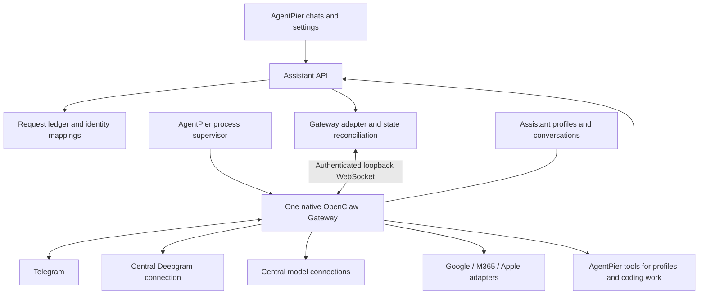

# Managed assistant Gateway design

Status: proposed design, not implemented. Date: 2026-10-07.
Companion to [ADR 0002](adr/0002-managed-openclaw-assistants.md) and the
[status/recovery evidence](research/openclaw-status-recovery-spike.md).

## User-facing shape

Agent chats remain directly reachable in the sidebar, with team members nested
under their assigning assistant. The Agents directory manages profiles. Per-agent
settings configure instructions, models, service access and team permission.

Place shared service operation under **Settings > Assistants > Runtime**. Call the
main card **Assistant service**; show OpenClaw as its managed runtime, not another
application the user must administer. The card shows readiness, host, active work,
restart preparation and diagnostics. Central model/service connections remain in
AgentPier. Technical details such as protocol, pin and private state locations are
secondary, expandable information; credentials never appear there.

The private interactive study illustrates three states with synthetic data:
ready, reconnecting, and reachable after an interrupted task. Its controls simulate
UI behavior only. DE/EN copy is included; publication does not deploy a service.

## Runtime boundary

AgentPier owns process lifecycle, user authorization, central connection references,
request identities and its UI projection. OpenClaw owns its agent loop, session
internals and supported channel/tool execution. The browser talks only to the
AgentPier backend. No iframe of the upstream dashboard is needed.

One Gateway hosts several assistant profiles and their conversations. A separate
Gateway is a future deployment choice for independent lifecycle/configuration; it
does not automatically form a team with the first instance. Multiple profiles or
processes on the same native host are not an OS sandbox.

## Starting and operating the service

1. Provision the tested package and compatible Node runtime through installation
   and update paths. Keep the runtime pin distinct from AgentPier's own Node support.
2. Allocate private state/config/workspace/log locations, a loopback listener and
   backend-only credentials. Launch an owned foreground child with a narrow env.
3. Wait for authenticated readiness. An open port or live PID alone is insufficient.
4. Reconnect subscriptions and reconcile profile/session/run identities before
   presenting current status. Serve stored history while reconciliation is pending.
5. On unexpected exit, restart with bounded backoff. Preserve state, identify
   interrupted work and expose unresolved outcomes instead of replaying everything.
6. For a planned restart, pause new admission and let current work finish. Coordinate
   Gateway and channel ingress, not just AgentPier's HTTP queue. If work cannot drain
   in time, show the outstanding work and a separate explicit cancellation choice.
7. Keep updates explicit, with compatibility checks and backups. Rolling back a
   package does not necessarily reverse a state migration.

These are design requirements. The spike verified selected lifecycle and recovery
operations, not this complete supervisor or channel-draining implementation.

## Status model

| Layer           | Examples                                                   | Meaning                                                         |
| --------------- | ---------------------------------------------------------- | --------------------------------------------------------------- |
| Service         | starting, ready, reconnecting, stopped, failed             | Whether the managed runtime is reachable and usable             |
| Reconciliation  | current, checking, uncertain                               | Whether displayed task data has been refreshed from the runtime |
| Run             | queued, running, succeeded, failed, cancelled, interrupted | Outcome of a particular execution attempt                       |
| Action/delivery | pending, confirmed, failed, uncertain                      | Whether a requested external effect actually occurred           |

Keep session keys and run IDs separate. A session can be reused for several runs;
even the same run ID can appear when an interrupted request is retried in the tested
runtime. Record AgentPier attempt and action identities separately from runtime IDs.
Do not infer completion from text arriving, a wait timeout, or a diagnostic line.
Use terminal evidence and read back the session when events were missed.

A reconnect may safely reconcile a completed turn without executing it again.
A process crash may leave external effects uncertain. Before retrying, consult the
durable action record and the destination service; surface uncertainty when neither
can establish what happened. This does not change the agreed team autonomy default.

## Creating a permanent colleague

An assistant requests a scoped AgentPier tool operation containing the intended
role, task, lifetime and selected configuration. AgentPier checks authorization and
limits, allocates its durable identity, then calls the appropriate Gateway API.

- Existing profile, new persistent chat: delegate with `sessions_spawn` and
  `visible: true`, retaining parent/task mappings.
- New durable profile: call backend `agents.create`, apply selected settings and
  references, then start its conversation. Do not turn every transient task into a
  profile or grant the model unrestricted configuration-write credentials.

Default autonomous team creation asks first; standing permission is configurable
per assistant, and an explicit team instruction authorizes that assignment. The
durable-versus-task-bound choice and authorization for permanent provisioning still
need a product decision. The provisioning tool itself is not implemented.

## First implementation boundary

Begin with supervision, profile/conversation mapping, direct chat and reliable
status reconciliation. Gate Telegram/Deepgram and service adapters on their own
connection, delivery and recovery tests. Keep sandbox design deferred as agreed.
The broader release checks remain tracked in Plane.
