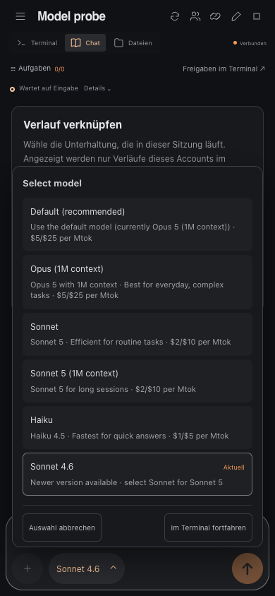

# Claude chat model switching

Validated on 2026-09-13 with Claude Code 2.1.270 and tmux 3.7c on macOS ARM64.

A disposable application and private tmux server reproduced two failures:

- At 50 columns, the native confirmation footer wraps across lines. Reading only
  its last line loses both picker recognition and the session-only action.
- After leaving a 390 × 844 mobile terminal view, the pane retains 43 × 31 cells.
  Claude clips the model dialog. The chat stream's `ignore-size` control client
  remains attached but has no visible terminal.

The native browser probe opened the mobile terminal, entered a native draft,
switched to Chat, entered a chat draft, opened the model picker and selected
Haiku. The real browser, HTTP routes, controller, tmux transport and Claude CLI
completed the switch from Sonnet 4.6 to Haiku 4.5. Both drafts survived, the picker
closed and the browser stayed in Chat. The disposable profile's default model
remained unset. No real account, provider credential or remote model request was
used.

Automated coverage includes native wrapped screen fixtures, controller selection
and cancellation, stale confirmation tokens, default-only dialog rejection and
input blocking after a controller restart. A real tmux integration test includes
the chat observer and verifies that visible terminals retain their dimensions and
reattachment resumes automatic sizing. Mobile browser coverage runs the real model
parser and controller with a controlled CLI boundary in German and English.

Run `node --test tests/unit/models.test.js tests/integration/model-viewport.test.js`
and `npx playwright test tests/browser/claude-model-control.spec.js tests/browser/model-control.spec.js`.
Set `AGENTPIER_TEST_BROWSER=webkit` for the WebKit browser run.
