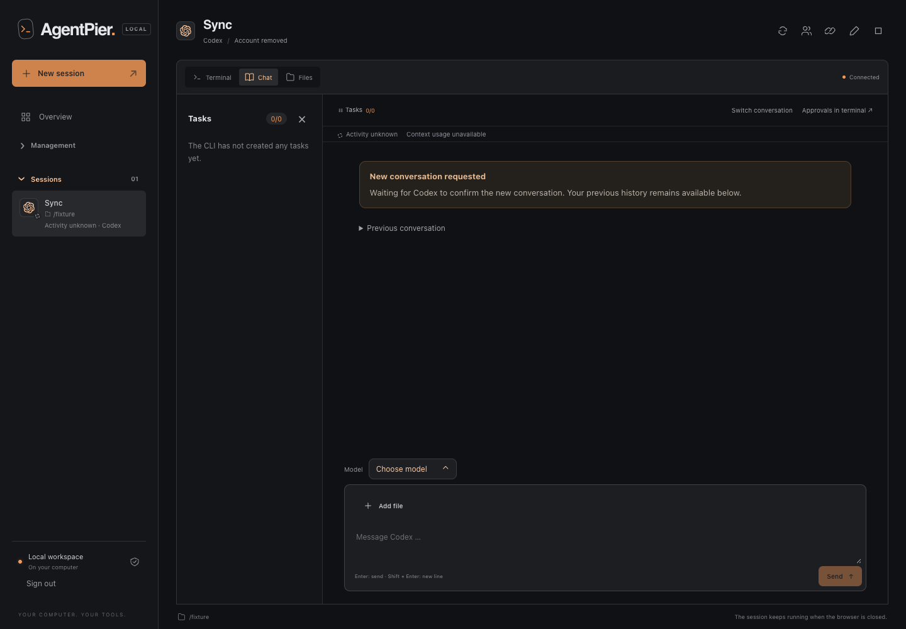

# Direct chat TUI validation

Native characterization was run on 2026-09-11 using macOS arm64 (Darwin 25.5.0),
Node.js 26.7.0, and private tmux sessions at 120 × 35 cells. Each run created a
fresh application data directory, HOME, provider profiles, and project. No existing
user session, credential file, or default tmux server was used. Initial Claude
characterization used `--bare`, which its installed help documents as disabling
keychain/OAuth reads. The final bound Claude run enabled the real plugin hooks in
normal mode, with both profile directories redirected to the fixture. On macOS,
Seatbelt denied reads of the actual user keychain/Claude profiles and execution of
`/usr/bin/security`. An unprivileged, ad-hoc-signed copy of the system `ps` binary
inside the fixture allowed real process inspection under Seatbelt; the platform
`/bin/ps` refuses execution inside that sandbox. This copy was removed with the
fixture and did not replace the system binary.

The local provider implements minimal Responses and Anthropic streaming responses
on a dynamically allocated loopback port. Its credential is the literal synthetic
string `synthetic-probe-key`; it never requests tool execution. This exercises the
real installed CLIs and their input queues, while synthetic recorder tests exercise
only byte transport. Neither establishes provider billing, authentication, or
behavior during actual tool execution.

## Reproduce

```sh
node scripts/probe-chat-tui.mjs --synthetic
node scripts/probe-chat-tui.mjs --native --tool codex --local-mock
node scripts/probe-chat-tui.mjs --native --tool claude --local-mock
node scripts/probe-chat-tui.mjs --native --tool opencode --local-mock
node scripts/probe-chat-tui.mjs --native --tool codex --local-mock --http --bound
node scripts/probe-chat-tui.mjs --native --tool claude --local-mock --http --bound
node scripts/probe-chat-tui.mjs --native --tool opencode --local-mock --http --bound
```

Native mode without explicit `--local-mock` exits with status 2 and a
`not-executable` result. The probe never imports real credentials. The fixture owns
and removes its processes, private tmux socket, profiles, and project. Only
synthetic markers, timing summaries, and sanitized screens are printed.

Add `--http` to test the current application HTTP delivery path, including durable
receipts and composer guards. This records server HTTP-entry-to-Enter-completion
separately from caller-start-to-receipt and visible-echo latency. Native runs use
one stable delivery ID per HTTP operation, without automatically retrying failed
operations. Without `--http`, measurements describe direct tmux input only.

## Native input characterization

### Explicit fresh input policy (2026-09-12)

For Codex and OpenCode, a fresh chat send behaves like typing into the current TUI
composer and pressing Enter. An existing draft or an unrecognized screen layout does
not reject that explicit send; native input can combine the existing draft with the
pasted text. Claude follows the prompt-box policy described below.
The same rule applies to an explicit retry whose durable journal proves that no
paste was attempted (`reserved`). No draft-clearing keystrokes are injected.

This permission does not weaken recovery of an already pasted message: submitting
that existing draft still requires an exact text match and unchanged generation.
Ambiguous paste/submit attempts never retry automatically. Session/account/process
identity, reload and pipeline guards remain enforced, and pending native permission
requests are checked immediately before both paste and Enter. An unreadable screen
does not bypass those guards. Exact native-history matching remains presentation-only;
combined drafts may remain unconfirmed when they differ from the original chat text.

The native recovery probe also tests that a fresh message appends to an edited
manual draft once, while retrying the earlier, now-changed draft remains blocked.
Real tmux integration tests cover unrecognized composers and a permission request
that arrives after paste: the latter must prevent Enter.

### Claude prompt-box guard and draft replacement (2026-09-22)

Claude Code shows permission prompts, the rewind selector (Esc Esc) and pickers in
place of its ruled prompt box. A bracketed paste into such a dialog is discarded and
the following Enter confirms the dialog; the probe reproduced an approved Bash
command. Fresh Claude input therefore never sends Enter while a dialog is visible.

An existing Claude draft (for example a prompt restored after Esc) is replaced, not
extended. The server sends `C-e C-u`, then `BSpace`, and `DC` only when Backspace
changed nothing, re-reading the prompt after each step until it is empty. Escape
and Ctrl-C are never used for clearing: Ctrl-C interrupts a running turn and Esc Esc
opens the rewind selector. Before Enter the pasted text must be visible in the
prompt box; after Enter the prompt must be empty or show Claude's queued-message
placeholder within five seconds. Otherwise the receipt is `uncertain` with
`CHAT_SUBMIT_UNCONFIRMED`, which offers the existing inspection and TUI path
instead of waiting indefinitely.

Validated against Claude Code 2.1.280 with a private tmux socket, a disposable HOME
and the loopback provider: single-line, wrapped (300 characters), multi-line,
collapsed pasted text, image-chip, cursor-on-first-line, cursor-mid-line and
bash-mode drafts were all cleared; the following message reached the provider
without the old draft and without an image. Clearing a draft during a running turn
did not interrupt it. Captured frames are in
`tests/fixtures/tui-input/claude-2.1.280-screens.json`.

### Chat never blocks on terminal state (2026-09-23)

AgentPier 1.20.0 refused chat messages with `CHAT_COMPOSER_NOT_CLEARED` when a
draft typed in the terminal could not be proven cleared (reproduced in a 50×34 pane
during a long turn). The policy is now that a chat send always reaches the CLI; the
terminal state only changes how:

- **Draft in the prompt:** replaced as above. When clearing cannot be proven (no
  progress, key or time budget, unexpected state), the chat text is pasted after
  whatever the prompt still holds and submitted. The receipt carries the
  informational notice `CHAT_APPENDED_TO_DRAFT` ("Sent together with text that
  was already in the terminal prompt").
- **Unreadable prompt** (no ruled prompt box around the cursor, no dialog): paste
  and Enter as before 1.20.0, notice `CHAT_PROMPT_UNREADABLE`. The emptied prompt
  cannot be observed there, so an unreadable screen after Enter still counts as
  handed off; a prompt that visibly keeps the text stays `CHAT_SUBMIT_UNCONFIRMED`.
- **Questions** (permission prompts, plan approval, AskUserQuestion; any dialog
  with a question-shaped row) are never closed by AgentPier: Escape would deny or
  cancel them. The message stays `pending` with `waiting: "dialog"`; the chat shows
  that it waits for the dialog in the TUI, with an "Open TUI" action, and delivers
  it automatically once the prompt box is back.
- **Requests mirrored in the chat** (questions and permissions brokered by the
  AgentPier hooks, startup dialogs) likewise hold the message with
  `waiting: "request"`. The composer stays usable while such a request is open;
  the queued message follows the answer without retyping.
- **Menus without a question:** only the rewind selector and the `/model` picker,
  recognized by their title directly below the `▔` panel border, are closed with
  single Escape presses, at most three and at least 1.2 s apart so they never form
  Esc Esc or reach a busy prompt. Notice: `CHAT_DIALOG_CLOSED`. A footer such as
  `Esc to cancel` is never enough: in a short pane (40×12, 36×12, 30×10) a
  permission prompt scrolls its question away and shows only its options and
  `Esc to cancel · Tab to amend`, and Escape would deny the tool call. Numbered
  Yes/No options, `Tab to amend`, `ctrl+e to explain` and `↓ N.` scroll markers
  therefore mark a question. Any other menu holds the message like a question; a
  menu that stays open is not sent Escape again while the message waits.
- **Images:** when Claude does not show every pasted image chip within ten
  seconds, the message is still submitted with the notice
  `CHAT_IMAGES_MAYBE_MISSING`; the file paths remain in the text.

Waiting happens outside the session lock, so the user can answer in the terminal
meanwhile; while a dialog holds a message, the screen is re-read without the lock
and the next attempt only starts once it changed. Only the phase the journal
proves is continued: a message held before its paste is pasted once later; one
held between paste and Enter keeps waiting while any dialog is open and then only
receives Enter while the prompt box is exactly the one seen right after the paste
(this covers appended, multi-line and image messages); without that record the
exact one-line text must still show. A changed prompt ends as `uncertain` with
`CHAT_PROMPT_CHANGED`, never with a blind Enter. Messages queue per session in
order behind a held one, and a held message can be cancelled until its text is
typed. A waiter
lost to a server restart leaves an `uncertain` receipt whose reason says the text
was not typed yet ("Deliver again" resends it); after twelve hours of waiting the
receipt ends as `rejected` (nothing typed) or `uncertain` (pasted). A rejected
message releases the chat composer with its text instead of locking it.

Codex and OpenCode keep appending to an existing draft (notice
`CHAT_APPENDED_TO_DRAFT` when the draft was readable) and share the request wait;
the dialog and menu rules apply to Claude only.

A `▔` panel border, or a selected numbered option (`❯ 1.`) at the cursor or
followed by further options, also marks a dialog,
because a short pane can scroll the footer away: at 50×34 the `/model` picker
shows neither footer nor selected row; during validation, treating it as an
unreadable prompt let Enter select the highlighted model and lost the message. The rewind selector and model picker are recognized by
their titles and closed with Escape even without a visible footer. Short-pane
frames are in `tests/fixtures/tui-input/claude-2.1.280-dialogs-short.json`. An appended
message starts on its own line after the remaining draft.

Live validation on 2026-09-23 with Claude Code 2.1.280 through the real
`SessionManager` and `ChatDelivery` (private tmux socket, disposable HOME,
loopback provider), in 50×34 and 120×35, with Claude's own cursor cell and with
`CLAUDE_CODE_NATIVE_CURSOR=1` plus `CLAUDE_CODE_ENABLE_PROMPT_SUGGESTION=1`:

- Busy 25 s turn in auto mode with one background shell and a draft typed through
  the attached terminal: handed off in about 0.4 s, draft replaced, the turn was
  not interrupted. With clearing forced to fail, the provider received
  `<draft>\n<chat text>` with `CHAT_APPENDED_TO_DRAFT`.
- Permission prompt: the message stayed pending, AgentPier sent no key; a single
  Escape typed by the user denied the tool call ("The user doesn't want to proceed
  with this tool use", no marker file) and the message followed automatically.
- AskUserQuestion: held until the user answered in the terminal; the answer and
  then the message reached the provider.
- Rewind selector and `/model` picker (also footer-less at 50×34): closed with one
  Escape, conversation and model unchanged, message delivered.
- Simulated mirrored request: held with `waiting: "request"`, delivered after it
  cleared.

Without the native-cursor prompt fix, the native cursor still delivered the
message but left the receipt `CHAT_SUBMIT_UNCONFIRMED`, because the emptied
prompt with a dim suggestion was not recognized as empty.

Synthetic coverage: `tests/unit/claude-chat-fallback.test.js`,
`tests/unit/claude-composer.test.js`, `tests/unit/claude-composer-edges.test.js`
(narrow frames in `tests/fixtures/tui-input/claude-2.1.280-dialogs-narrow.json`),
`tests/integration/chat-never-blocks.test.js`
(owned tmux, 50×34 stuck draft, menu, question) and
`tests/integration/chat-delivery-composer.test.js` (deferral, receipts, restart).

### Chat after terminal submission regression (2026-09-13)

The manual-input render guard used to remain set until it saw a complete,
short draft. Submitting a collapsed or multiline paste, or sending text and Enter
in the same browser input frame, could therefore leave all subsequent Chat sends
and explicit pre-paste retries rejected even after the native CLI had answered.

The guard now recognizes explicit terminal Enter, Ctrl+C and Ctrl+U as ending the
outstanding input operation. Later printable input marks it pending again. This
tracks user input intent, not provider acceptance or proof of an empty composer;
the explicit fresh input policy above still applies. Unsubmitted input that has
not rendered remains protected, as does exact-match recovery of a prior paste.

Each attached terminal keeps bounded protocol state across input frames. Pasted
carriage returns and modified Enter do not count as submission. Automatic terminal
replies, including fragmented OSC color reports, do not become phantom drafts.
The guard retains no prompt text. No timeout, background resend or extra Enter is
introduced, and request, session-generation and at-most-once guards remain active.

Unit regressions cover all three CLIs, batched and fragmented input, paste boundaries,
modified Enter, explicit clearing and terminal replies. Owned tmux/HTTP integration
checks reject the unsubmitted paste, accept its explicit retry after terminal Enter,
and deliver the next fresh message exactly once. The existing delayed-render race
regression still passes.

The bound native probes below were run with Codex 0.153.4 and Claude Code 2.1.270 on
macOS arm64 using only the disposable local provider. Both accepted a long multiline
paste through the browser terminal attachment, answered after one terminal Enter,
and then accepted Chat with exactly one paste and one Enter; replay wrote no bytes.
The same runs passed busy queueing, payload preservation and guarded draft recovery.
Claude also passed the seven-image preparation case. OpenCode has synthetic
transport coverage for this regression; a native run is not claimed here.

```sh
node --test tests/unit/manual-input-guard.test.js tests/unit/manual-input-submit.test.js \
  tests/integration/terminal-chat-render-race.test.js tests/integration/chat-tui-input.test.js
node scripts/probe-chat-tui.mjs --native --tool codex --local-mock --http --bound --samples 2
node scripts/probe-chat-tui.mjs --native --tool claude --local-mock --http --bound --samples 2
```

### Claude startup dialogs (2026-09-13)

A fresh AgentPier Claude profile runs Claude Code's full first-run onboarding
before the composer exists. With Claude Code 2.1.270 the sequence is theme
selection, the custom API key confirmation (API-key accounts), security notes
and the folder trust dialog; OAuth accounts show the login method and browser
code screens instead. Only the trust dialog used to be recognized, and its
default selection is "No, exit", so a chat send that pasted text and Enter into
any of these screens either exited the CLI or advanced a dialog blindly.

Every startup dialog is now published as a local native request while the
session's native receipt is still missing. Theme, API key, security notes and
trust are answerable from chat; the answer moves the native selection with
Up/Down until the screen confirms it, presses Enter once and waits for the
dialog to leave. Login and unrecognized startup menus appear as blocking cards
that only open the terminal. Chat input refuses to paste while any startup
dialog is visible, including unknown menus before the receipt; after the
receipt, only the specific dialogs are still recognized so in-session prompts
are not misread. No onboarding flags are seeded into the profile.

```sh
node --test tests/unit/claude-startup-prompts.test.js tests/integration/claude-startup-prompts.test.js \
  tests/unit/session-chat-input-policy.test.js
node scripts/probe-chat-tui.mjs --native --tool claude --local-mock --http --bound --fresh-profile --samples 1
```

The fresh-profile probe keeps the disposable profile empty, waits for each
native dialog at 50 columns, verifies that an HTTP chat send is rejected, answers
through the request route and finally repeats the folder trust and recovery
checks. It passed with Claude Code 2.1.270 on macOS arm64 against the local
provider only. Synthetic frames in `tests/fixtures/requests/claude-startup-prompts.js`
mirror the recorded 120- and 50-column screens.

### Claude image preparation regression (2026-09-12)

Claude Code 2.1.269 reproduces a separate paste/submit race with larger image
attachments. Seven synthetic 1536 × 1024 PNGs (about 4.7 MB each) were pasted as
newline-separated absolute paths through the bound HTTP route. The old writer
sent one Enter immediately after paste and returned a handoff receipt, but the
native CLI remained at the input prompt with all seven image chips and the text.
No corresponding request reached the local mock provider within 15 seconds.
The probe does not compensate by sending a second Enter.

The writer now waits for all existing local PNG/JPEG/GIF/WebP paths in that paste
to become image chips inside the current fenced Claude composer before sending
its single Enter. Image labels in old conversation output do not count. The wait
is bounded to ten seconds; failure leaves the journal at `pasted`, reports an
uncertain delivery, and does not send Enter. Existing recovery rules still require
an exact current draft match, so transformed image drafts may require manual TUI
submission. Generation checks remain in place immediately before submission.
Plain text and other CLIs retain their existing transport without an added pause.

The corrected bound native probe passed all seven images to the local provider,
observed a response and counted exactly one paste and one Enter. In the final
recorded run, image submission took 751.79 ms. The same run passed 30 sequential
text prompts, the held-response queue case, multiline/long payloads and guarded
short-draft recovery. This measurement is specific to the local test files and
machine, not a universal image-processing latency guarantee. The original
zero-delay measurements below describe text input only.

Short panes (2026-09-23): chip counting uses the same prompt-box detection as the
draft guard, so a box whose bottom border is clipped (rows reach the last screen
row, cursor inside) is counted. Only visible rows count. When Claude scrolls a
tall draft inside its box, chips at its start leave the screen; the count then
stays short, no Enter is sent, and after ten seconds the delivery is `uncertain`
at `pasted` with `CHAT_IMAGES_UNCONFIRMED`. Validated with Claude Code 2.1.280 and
the loopback provider at 60×8, 60×9, 60×11, 40×10 and 120×35 with one and three
images: short and wrapped drafts whose chips stay visible now reach the provider
with every image (previously uncertain at 60×8–11 and 40×10). A three-image draft
scrolled past its first row fails with the new reason. Frames are in
`tests/fixtures/tui-input/claude-2.1.280-image-screens.json`.

| CLI         | Installed version | Held-response observation                                                                                        | Submit                                                 |
| ----------- | ----------------- | ---------------------------------------------------------------------------------------------------------------- | ------------------------------------------------------ |
| Codex       | 0.153.4           | Second marker shown under “Messages to be submitted after next tool call” while the first response remained open | Separate Enter after bracketed paste, zero added delay |
| Claude Code | 2.1.266           | Second marker shown in the native queue; empty composer displays “Press up to edit queued messages”              | Separate Enter after bracketed paste, zero added delay |
| OpenCode    | 1.18.30           | Second marker shown in a message card marked QUEUED while the first response remained open                       | Separate Enter after bracketed paste, zero added delay |

The provider held the first response open for eight seconds. The probe submitted a
second marker after observing the first provider request and a 1.5-second pause.
It asserted that the native queue indication appeared before the held response
completed. It then observed a synthetic response to the second marker. This is an
observed native queue acceptance, independently of the terminal write result.

Each CLI additionally completed 30 sequential short-marker prompts. Every prompt
received one bracketed paste and one subsequent Enter; the probe never sent a
second Enter to compensate for a timeout. Existing Codex literal slash commands
retain their separate 250 ms paste-burst interval; these measurements do not test
removing that interval.

Fresh Codex and Claude onboarding required a 750 ms pause after displaying a
trust/key confirmation before sending the one authorized onboarding selection. Earlier
attempts sent startup keys before the dialog input handler was ready; those runs
stopped without sending a prompt. This startup accommodation is separate from the
zero-delay paste/Enter message transport.

## Local direct-tmux measurements

Values are milliseconds, rounded to two decimal places; 30 samples per CLI. The
start clock is the probe process immediately before tmux buffer loading. Submit
includes buffer loading, paste, Enter, and buffer cleanup. Visible echo is polled
via capture-pane at approximately 20 ms intervals and is an upper-bound observation,
not the moment of a terminal render or provider acceptance.

| CLI         | Submit p50 | Submit p95 | Submit max | Visible echo p95 |
| ----------- | ---------: | ---------: | ---------: | ---------------: |
| Codex       |      17.63 |      22.91 |      23.37 |            28.32 |
| Claude Code |      19.56 |      21.75 |      21.97 |            27.21 |
| OpenCode    |      19.28 |      21.77 |      22.86 |            28.01 |

The synthetic recorder separately observed exactly one bracketed payload followed
by one carriage return for each of 30 markers per tool. Its p95 direct-write
latencies were 22.25 ms (Codex label), 24.90 ms (Claude label), and 22.72 ms
(OpenCode label). The recorder labels do not change the executable: all three are
a synthetic raw-TTY Node.js program. These values are not native CLI benchmarks.

The old Codex queue path was not benchmarked before production edits. These
measurements therefore do not establish an improvement over the old queue path or
explain an earlier report of multi-second latency.

## HTTP delivery and native recovery

The final complete HTTP route, including actual `NativeSessionBinding.prepare`
launch hooks/plugins, live native receipts, composer guards, and durable journal
writes, passed the held-response/second-queued scenario and 30 sequential prompts
per CLI. No request, model, identity, or receipt guard was stubbed. Final runs
completed at 16:00–16:02 UTC on 2026-09-11. Instrumentation measured
HTTP server entry and completion of the actual tmux Enter command with the same
monotonic clock. These runs were concurrent with other development validation. Their measured
HTTP-entry-to-Enter p95 values meet the local 500 ms objective; no unloaded-host
claim is made. The earlier direct-tmux table remains a separate transport measurement.

| CLI         | HTTP entry → Enter p50 | HTTP entry → Enter p95 | Maximum | Visible echo p95 |
| ----------- | ---------------------: | ---------------------: | ------: | ---------------: |
| Codex       |                 138.55 |                 151.81 |  152.56 |           892.26 |
| Claude Code |                 148.39 |                 207.93 |  250.65 |           684.14 |
| OpenCode    |                 147.57 |                 198.00 |  232.31 |           909.02 |

Claude and OpenCode had verified native receipts before the first HTTP message.
Codex creates its native receipt only after its first UserPromptSubmit in this
configuration. Its final run therefore sent the first message through HTTP with a
validated pending launch, then required the real hook receipt before proceeding.
No direct bootstrap message was used in any final bound run. A pending native
identity authorizes initial delivery but records no recovery identity; it cannot
be used to recover a potentially submitted prompt. Missing/invalid launch records
and invalid existing receipts still reject input.

The echo interval begins at the caller before HTTP and is observed after receipt;
it is intentionally separate from HTTP-entry-to-submit. Earlier heavily concurrent
runs had roundtrip p95 values above 500 ms; the local objective applies to an
unloaded host, so those values are not silently dropped or used as acceptance.

For each actual CLI, the HTTP probe also persisted `pasted` and then injected one
storage exception, leaving the full short marker visible in the native composer.
Recovery returned `submitted-existing`: **zero new pastes and one Enter**. Replaying
the recovery attempt produced zero additional writes. A second injected failure
left a different draft; deleting its last three characters manually caused recovery
to return `blocked` with zero writes and unchanged composer contents.

These recovery assertions count real tmux paste and Enter commands independently
and verify the recovered marker receives a native response. The fault injection
runs only in the disposable application. It does not claim to reproduce an OS
crash, nor permit retry after `submit-intent`.

## Native multiline and long payload acceptance

A separate bound HTTP run with `--samples 1` exercised two additional payloads per
CLI, while retaining the 30-sample timing table above. The first combines CRLF/CR
normalization, Unicode (`Grüße`, CJK, emoji), a path with spaces, a tab, and multiple
lines. The second contains 120 lines and 9,013 UTF-8 bytes after normalization,
well beyond the pane's visible height. Each case produced exactly one tmux paste,
one Enter, and a visible native response to its unique marker.

The local provider compares SHA-256 and byte length of actual user text blocks in
completion requests. Token-count requests are excluded. It retains only synthetic
marker/length/hash evidence, not payload text. Provider preservation is distinct
from AgentPier's exact byte transport: the installed CLIs apply these observed
native transformations.

| CLI         | Multiline payload at provider                                         | Long payload at provider                               |
| ----------- | --------------------------------------------------------------------- | ------------------------------------------------------ |
| Codex       | Exact normalized input, 93 bytes                                      | Exact normalized input, 9,013 bytes                    |
| Claude Code | The single tab becomes four spaces; otherwise exact, 96 bytes         | Exact normalized input, 9,013 bytes                    |
| OpenCode    | One ASCII space appended; otherwise exact including the tab, 94 bytes | One ASCII space appended; otherwise exact, 9,014 bytes |

The probe asserts those precise transformations; it does not call them unchanged
provider text. The normalized multiline SHA-256 is
`a186aed178a9f7c5ba20f196d0a537d2d778c414a508085d1c82da8019fd5c9b`,
and the normalized long-payload SHA-256 is
`f4044dee18f1c3a5ae1cf8811dbc046054d8e968f88d0db7928478a1770f3619`.
No text or line loss beyond the stated native whitespace transformations was
observed. No compensating Enter, retry, or production adapter change was used.
The same runs also retained the busy-input and short-draft recovery assertions.

```sh
node scripts/probe-chat-tui.mjs --native --tool codex --local-mock --http --bound --samples 1
node scripts/probe-chat-tui.mjs --native --tool claude --local-mock --http --bound --samples 1
node scripts/probe-chat-tui.mjs --native --tool opencode --local-mock --http --bound --samples 1
```

## Composer evidence and release boundaries

### Terminal Shift+Enter

The attached terminal path has a separate native keyboard probe:

```sh
node scripts/probe-chat-tui.mjs --native --tool codex --local-mock --bound --keyboard-only
node scripts/probe-chat-tui.mjs --native --tool claude --local-mock --bound --keyboard-only
node scripts/probe-chat-tui.mjs --native --tool opencode --local-mock --bound --keyboard-only
```

On the macOS host and CLI versions above, tmux 3.7c reduced the previous CSI-u
Shift+Enter sequence to plain Enter. The corrected mapping sends native Alt+Enter
(`ESC CR`) through the same attached client used by the browser. Each CLI retained
both lines without a provider request, then accepted the exact 39-byte multiline
text after one ordinary Enter. All three yielded SHA-256
`c4669f280f5da711262b55032517ca15fb18df60bbd1fc054d65c1e345f23ac9`.
The probe also waits for the first typed line before inserting the newline.
Custom CLI keybindings remain outside this characterization.

### OpenCode with AgentBus enabled

On September 11, 2026, the native OpenCode 1.18.30 probe was repeated with
`--native --tool opencode --local-mock --bound --keyboard-only --agentbus` on
macOS arm64. Before the SQLite adapter fix, the real plugin failed with
`No such built-in module: node:sqlite` and no provider request arrived. With
the runtime-specific built-in driver, the same probe preserved Shift+Enter
without submitting, then delivered the exact multiline payload after Enter.
The probe uses an isolated profile and a loopback synthetic provider, without
real credentials or model tool calls. Separate Node/Bun interoperability tests
cover message deduplication, exclusive claims, acknowledgements, and recovery
after a reader exits.

The same AgentBus-enabled keyboard probe also passed for Codex 0.153.4 and
Claude Code 2.1.266 on that host. All three delivered the same 39-byte UTF-8
payload, SHA-256 `c4669f280f5da711262b55032517ca15fb18df60bbd1fc054d65c1e345f23ac9`.

### Composer parsing

Sanitized `tests/fixtures/tui-input/*-native.json` files contain actual styled
`capture-pane -e` output and tmux cursor coordinates. Plain screen text is
insufficient to distinguish a placeholder from a user who typed exactly that
placeholder. The parser uses cursor position, styling, composer boundaries, and
complete visible input; unknown states must reject before writing.

Observed states include idle, busy, queued-while-busy, and a short Unicode draft.
OpenCode also has a native Plan-mode composer capture produced by Tab; its message
benchmark ran in Build mode.
Codex uses a dim placeholder and bold `›`; Claude uses a `❯` composer between
horizontal rules and an inverse-video cursor; OpenCode uses a left `┃` border,
model footer, and bottom border. These are observations of these installed
versions with their default styles and keybindings, not a promise that future
versions or customized themes preserve them.

The broader native recovery matrix remains open: multiline or collapsed drafts,
partially pasted prompts, approval/model dialogs, process replacement, and ambiguous
submit history need separate acceptance. Short complete drafts, explicitly edited
drafts, and recovery replay were exercised through actual HTTP and native TUIs. Replaying a text marker
from scrollback never proves the current composer contains that text. The probe
captures a draft without submitting it, then disposes its own session.

The remaining native matrix must be recorded before claiming full release
acceptance. Linux, custom keybindings/themes, actual tool
execution, and simultaneous external tmux/SSH typing are not covered by this run.

## Codex clear before the next prompt

The `--clear-only` mode reproduces the delayed identity transition using the same
isolated native CLI and loopback provider as the input probes:

```sh
node scripts/probe-chat-tui.mjs --native --tool codex --local-mock --http --bound --clear-only
```

On 2026-09-14, Codex CLI 0.153.4 cleared its terminal immediately after the HTTP
submission of `/clear`, but AgentPier still read the old native identity until the
next synthetic prompt. The probe verifies that the browser's durable draft store
records a requested reset, preserves that state on reload, and confirms it only
when a fresh snapshot identifies another conversation. The new conversation
contains none of the earlier synthetic prompt.

This is presentation state, not an acknowledgement of command execution. AgentPier
collapses unchanged pre-command messages after a successful handoff; new or updated
output stays visible, and rejected or uncertain handoffs retain the normal history.
The marker is scoped to this browser's session/account delivery storage, with
cross-tab ordering and restart checks. It is not shared across devices, and `/clear`
entered directly in the terminal still relies on native identity notification.
Browser tests cover the collapsed history, reload, uncertain/rejected delivery,
late responses, and explicit retry after restart in Chromium and WebKit.


