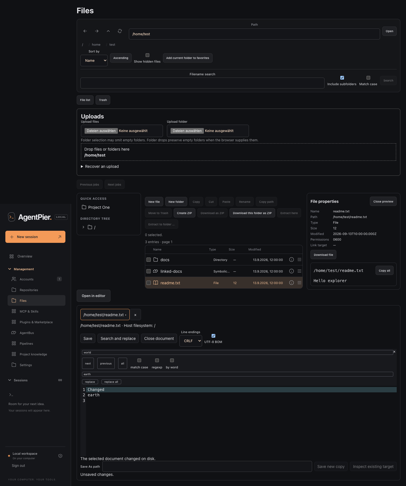

# File Explorer

AgentPier's file explorer browses, edits, transfers, and recovers files that the
AgentPier server process can access. Open **Files** for host-wide navigation or the
**Files** tab of a session for its project.



The final browser evidence also covers the
[mobile conflict controls](screenshots/file-explorer/chromium-en-mobile-conflict.png),
[upload recovery](screenshots/file-explorer/webkit-en-desktop-upload-recovery.png),
[German operations view](screenshots/file-explorer/webkit-de-desktop-operations.png), and
[mobile Trash confirmation](screenshots/file-explorer/chromium-de-mobile-trash.png).

## Access and scope

The two entry points have different boundaries:

- Global **Files** starts in the configured user's home directory. Its scope root is
  `/`, so mounted volumes are visible when the server's operating-system user can read
  their mount points.
- A session's **Files** tab is limited to that session's canonical working directory.
  A URL or request cannot widen the project boundary. Absolute project paths, `..`, and
  `~` are rejected. A followed symbolic link must also resolve inside the project.
- A headless pipeline session exposes its project as read-only.

AgentPier is not a filesystem sandbox. Reads and writes use the effective rights of the
user running the web service, including ACLs, mount options, and removable-media rights.
Running AgentPier as a more privileged user gives the explorer those additional rights.
Use a dedicated normal account and grant it only the directories it needs.

The normal login and same-origin checks protect browser requests. Session and MCP tokens
do not grant access to global **Files**, and machine Authorization tokens are rejected on
these browser endpoints.

## Browse and inspect

The location field, breadcrumbs, favorites, project shortcuts, and directory tree change
the current folder. Show hidden files explicitly when dot-prefixed names should appear.
Sorting and paging operate on a 30-second directory snapshot. Refresh after a snapshot
expires or when an external program changes the folder.

A listing contains at most 100,000 entries and returns 200 entries per page by default.
AgentPier retains at most eight listing snapshots. Search and size calculations run as
bounded jobs rather than blocking a listing.

The properties panel reports the selected path, entry type, regular-file size, modification
time when available, mode bits, readable/writable hints, symbolic-link target, and an
observed revision. A symbolic link is selected without following its leaf; preview, text
read, and download follow its target within the current scope. Permission flags and
revisions describe what AgentPier observed. They are not a complete ACL, xattr, generation,
or file-history record, and identical inode/stat observations can hide inode reuse or a
ctime-only change.

Names are limited to 255 UTF-8 bytes. `/`, control characters, `.` and `..` are invalid.

## Preview, download, and edit

Valid UTF-8 text up to 2 MiB opens in the editor. NUL/binary data and UTF-16 do not. PNG,
JPEG, GIF, and WebP images preview up to 20 MiB. A regular file can still be downloaded
when no preview is available; direct downloads stream instead of buffering the complete
file in AgentPier.

The editor preserves an optional UTF-8 BOM, LF or CRLF line endings, and trailing newlines.
Mixed endings and bare CR require an explicit output choice. It displays a selected
symbolic-link path separately from its resolved target and saves through the selected
identity. A file with more than one hard link is read-only in place; **Save As** creates a
new independent file.

On macOS, an in-place save strictly preserves mode, uid, gid, ACL, and extended attributes.
It does not preserve the old content modification time. The current Linux adapter cannot
certify complete metadata preservation on a new inode because namespaces such as
`trusted.*` can be hidden. Existing files therefore open read-only for in-place editing on
Linux, and overwrite or cross-device actions that require strict preservation refuse
before mutation. **Save As** can create an independent new file or retain a draft that
already exists; it does not make the existing Linux source editable. Same-inode
rename/exchange remains available.

Tabs, drafts, and attempted save bytes exist only in browser RAM. They remain while moving
between routes, sessions, modes, or working directories in the same running page, but a
reload, tab close, browser close, or crash discards them. AgentPier does not autosave them
to browser storage, URLs, jobs, or audit records.

Dirty, pending, and unresolved-attempt tabs guard tab close and Back/Forward navigation.
An uncertain or failed save retains the exact attempted bytes for an explicit retry. Only
`FILE_CONFLICT_CHANGED` opens the current-disk comparison. Choose the current version,
edit manually, use **Save As**, or explicitly replace at the newly observed revision.
There is no generic retry of a text save through the Operations job list.

Tab inserts indentation in CodeMirror. To move keyboard focus out of the editor, press
Escape and then Tab within two seconds.

## File operations

Create, rename, copy, move, Trash, restore, purge, ZIP creation/extraction, search, size,
and upload use bounded operations. New files use mode 0600 and new directories 0700,
subject to the process umask.

Long-running work appears under **Operations** with one of these states: `queued`,
`running`, `waiting_for_conflict`, `cancelling`, `completed`, `partially_completed`,
`failed`, `cancelled`, or `interrupted`. Conflict choices are **Replace**, **Skip**,
**Keep both**, and **Cancel**.
Folder merge is available only for copy or move. A restore collision first needs **Keep
both**; merge the retained directory later with an explicit copy or move.

Merging into a directory retains the existing destination root's inode, owner, mode, ACL,
and extended attributes. Its timestamps can change. Children use their normal copy/move
preservation rules.

Replacing an entry moves the displaced version to private Trash. Cancellation stops new
work and preserves results that already completed. A move can publish its destination
before source cleanup finishes; inspect the displayed `outputPublished`, `sourceRemoved`,
and `sourceRemovalPending` outcome before trying it again.

Recorded operation checkpoints allow AgentPier to reconstruct jobs after a web-service
restart. Recovery replays durable facts, then observes the current filesystem before a new
destructive step. It is not a historical filesystem journal. A native process can change
a path after the last observation, and final finite cleanup has an unavoidable check/action
race with another process of the same user. AgentPier does not provide inode compare-and-
swap or general online replay protection.

### Interrupted replacement example

Suppose `/example/reports/report.txt` is replaced. AgentPier may have published the new
file and retained the previous version in Trash before the browser loses the response.
Open **Files → Operations** after reconnecting and inspect the recovered job and both
displayed versions. Do not repeat the move just because the browser did not receive its
reply. Open **Files → Trash**, compare the retained synthetic entry, and explicitly restore
the desired copy when the UI marks it eligible. A pending, changed, or unavailable Trash
entry stays retained and cannot be restored or purged until AgentPier can prove its state.

Trash has no expiry. **Delete permanently** requires explicit confirmation. Large
selections are submitted in finite batches that fit the 64 KiB JSON request limit, so an
earlier batch may already have completed when a later one fails. Permanent deletion is not
secure overwrite, and AgentPier never silently falls back from Trash to permanent delete.

## Uploads and archives

Selected browser `File` handles are RAM-only. After a reload, reselect every unfinished
file with the same relative path and size. AgentPier never resends rows already marked
completed, skipped, published, or `outputPublished`. Browser folder selection can omit
empty directories.

Upload name collision checks use Unicode 15.1 NFD plus a full case fold. This conservative
policy can reject two names that a case-sensitive filesystem would allow; it is not proof
of the mounted filesystem's own equivalence rules.

ZIP creation omits symbolic links and asks for explicit acceptance of the omission list.
Extraction rejects unsafe paths, encrypted entries, corruption, depth/entry/byte excess,
and aliases under the proven target policy. It is supported only when native checks prove
the exact policy of live APFS or unencrypted ext4. Unknown filesystems, unavailable native
metadata, insufficient permission, encrypted ext4, and other formats refuse before the
first output. A policy change during extraction can still leave a partial result.

Direct and ZIP downloads share the configured concurrent-transfer limit per owner. A ZIP
download is shown only after its artifact is durably ready; the download request remains
authoritative.

## Limits and retention

Defaults are read at server startup:

| `files.limits` key  |        Default | Purpose                           |
| ------------------- | -------------: | --------------------------------- |
| `listPageSize`      |            200 | entries per listing page          |
| `listEntries`       |        100,000 | entries in one directory snapshot |
| `searchEntries`     |        100,000 | entries inspected by search       |
| `searchResults`     |         10,000 | search results                    |
| `searchMs`          |         30,000 | search duration in milliseconds   |
| `textBytes`         |      2,097,152 | editor/read bytes                 |
| `imageBytes`        |     20,971,520 | image preview bytes               |
| `uploadBytes`       | 10,737,418,240 | one upload file                   |
| `jobBytes`          | 53,687,091,200 | operation payload bytes           |
| `jobEntries`        |         50,000 | operation entries                 |
| `maxDepth`          |            128 | traversal/archive depth           |
| `transfers`         |              3 | concurrent transfers per owner    |
| `jobsRetentionMs`   |    604,800,000 | terminal-job retention window     |
| `uploadRetentionMs` |     86,400,000 | inactive upload window            |

To override a value, stop AgentPier, edit `$AGENTPIER_DATA_DIR/config.json`, and restart it:

```json
{
  "files": {
    "limits": {
      "searchResults": 5000,
      "transfers": 2
    }
  }
}
```

Every value must be a positive safe integer and every key must be recognized; invalid
configuration prevents startup. There are no environment variables or Settings controls
for individual file limits. Job, Trash, and operation-result pages use a separate fixed
page size of 200. Metadata size observations and ZIP output also have separate internal
bounds; `jobBytes` does not configure them.

Terminal jobs become eligible for cleanup seven days after completion only when no
unresolved publication, child job, or Trash record pins them. Completed unclaimed ZIP
artifacts have the same seven-day window. Inactive incomplete uploads are considered after
24 hours only without an active owner; ambiguous content remains retained.

Native metadata capture accepts at most 256 xattrs, 64 KiB of xattr names, 8 MiB of xattr
values, and a 64 KiB Darwin ACL. Exceeding a bound refuses the operation rather than
silently dropping metadata.

## Storage and backups

Private Explorer state lives under `$AGENTPIER_DATA_DIR/files`, including SQLite state,
Trash payloads, recovery journals, and staging/transfer artifacts. Do not edit it manually
or build integrations against its private path layout. These internal paths remain
protected from Explorer operations even when global **Files** otherwise has OS permission.

AgentPier application backups exclude file Trash, file-operation journals, and transfer
bytes, even with **Include credentials**. They are not Explorer recovery exports. Move
needed files out of Trash and back up project/file content separately. Current application
backup configuration also does not restore custom `files.limits` overrides.

## HTTP boundary

The browser uses the following authenticated route families. They are documented to make
the security and recovery model explicit, not as a replacement for the UI:

- Global: `/api/files/...`
- Session: `/api/sessions/:id/files/explorer/...`
- Reads: `context`, `preferences`, `entries`, `metadata`, `preview`, `text`, `jobs`,
  `jobs/:jobId/entries`, `jobs/:jobId/retry`, `jobs/:jobId/upload-children`, and `trash`
- Mutations: `preferences`, `operations`, `jobs/:jobId/cancel`,
  `jobs/:jobId/resolve`, `jobs/:jobId/retry`, `upload-groups`, and `uploads`
- Streams: `uploads/:uploadId/content`, `jobs/:jobId/download`, and `download`

Every mutation uses the current opaque `X-File-Scope` returned by `context`. Operation
bodies include a stable `requestId`. Text PUT uses `X-File-Request` plus exactly one quoted
`If-Match` content revision, or `If-None-Match: *` for a new file. Reusing an operation ID
with different content is a conflict. Clients must re-read context after a session working
directory or read-only state changes.
