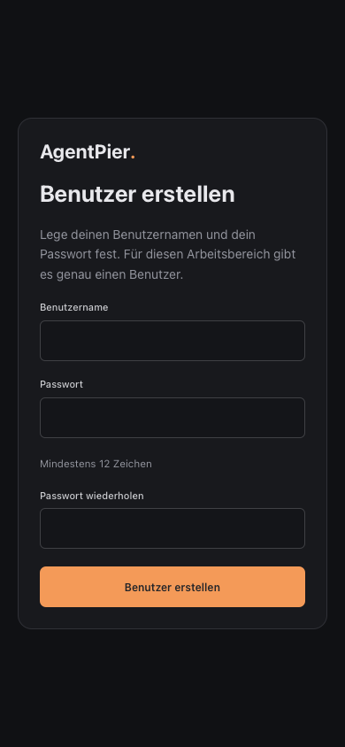

# Anmeldung am Arbeitsbereich

Beim ersten Öffnen zeigt AgentPier **Benutzer erstellen**. Wähle einen Benutzernamen und ein Passwort mit mindestens zwölf Zeichen. Die Einrichtung funktioniert sowohl lokal als auch über den bereits eingerichteten Fernzugriff. Der erste erfolgreich angelegte Benutzer gehört zum gesamten Arbeitsbereich; danach ist keine weitere Registrierung möglich. Bereits bestehende Arbeitsbereiche zeigen diese Einrichtung beim ersten Start einer Version mit Anmeldung ebenfalls an.

Anschließend erscheint auf anderen Geräten **Anmelden**. Die Sitzung bleibt sieben Tage gültig und übersteht einen Neustart des Webdienstes. **Abmelden** steht unten in der Seitenleiste, auf Mobilgeräten im geöffneten Navigationsmenü. Die Abmeldung widerruft die aktuelle Browsersitzung und schließt ihre Terminalverbindungen sofort; laufende CLI-Prozesse in tmux bleiben erhalten. Andere angemeldete Geräte bleiben angemeldet. Es können höchstens zwanzig Browsersitzungen bestehen; eine weitere Anmeldung widerruft die älteste.

Die Anmeldung ersetzt nicht die vorhandenen Host-, Origin- und Tailscale-Prüfungen. Der Webdienst lauscht weiter auf Loopback; der konfigurierte Tailscale-Zugang bleibt an das freigegebene Tailscale-Konto gebunden. Die Einrichtung benötigt weder eine E-Mail-Adresse noch einen externen Kontodienst.

## Speicherung und Wiederherstellung

Im Datenverzeichnis liegt `login/auth.json` mit Benutzername, gesalzenem scrypt-Passworthash und Hashes zufälliger Sitzungstoken. Das Verzeichnis erhält Modus `0700`, die Datei `0600`. Passwörter und unveränderte Sitzungstoken werden nicht in der Datei abgelegt. Der Browser verwendet einen Host-gebundenen HttpOnly-Cookie mit `SameSite=Strict`; beim konfigurierten HTTPS-Fernzugriff trägt er zusätzlich `Secure`. Anmeldung und Einrichtung sind zusammen auf zehn Hash-Versuche pro Minute begrenzt.

Normale AgentPier-Backups enthalten diese Anmeldedaten und Browsersitzungen nicht. Ein in ein neues Datenverzeichnis wiederhergestellter Arbeitsbereich beginnt daher mit einer neuen Benutzeranlage. Für ein vergessenes Passwort gibt es keine Web-Zurücksetzung: Der Besitzer des Server-Benutzerkontos kann bei gestopptem Webdienst die Datei `login/auth.json` aus dem Datenverzeichnis entfernen und anschließend den Benutzer neu anlegen. Dadurch werden alle bisherigen Browsersitzungen ungültig. Die erste Benutzeranlage steht nach dem Neustart wieder über jeden bereits erlaubten Zugang zur Verfügung.

## Technische Grenzen

`GET /auth/status`, `POST /auth/setup`, `POST /auth/login` und `POST /auth/logout` durchlaufen dieselben Host- und Origin-Prüfungen wie die Oberfläche. Die übrigen HTTP-APIs und Terminal-WebSockets benötigen eine gültige Browsersitzung, auch solange noch kein Benutzer angelegt wurde. Öffentlich erreichbare statische Dateien enthalten nur die Anwendung und Anmeldeseite, keine Arbeitsbereichsdaten.

Nur `GET`/`HEAD /api/health` bleiben für direkte lokale Aufrufe ohne Proxy- oder Tailscale-Header ohne Anmeldung erreichbar, damit Dienststart und Release-Aktivierung weiterhin ihre Versionsprüfung durchführen können. Über Fernzugriff benötigt auch dieser Endpunkt eine Anmeldung. MCP-Maschinenzugänge behalten ihre eigene OAuth-/Token-Authentifizierung; ihre Tokens berechtigen weiterhin nicht zum Aufruf normaler Browser-APIs. Native CLI-Anfragen nutzen unverändert ihre eigenen sitzungsgebundenen Kanäle.

`npm run dev` leitet sowohl `/api` als auch `/auth` an den Backend-Port weiter. Die bestehende explizite Freigabe der Entwicklungs-Origin bleibt erforderlich. Browser-Tests legen nur in ihrem isolierten Testserver einen temporären Benutzer an; Tests gegen einen externen Testserver können mit `TUIUI_TEST_STORAGE_STATE` eine vorhandene Playwright-Sitzung verwenden.

