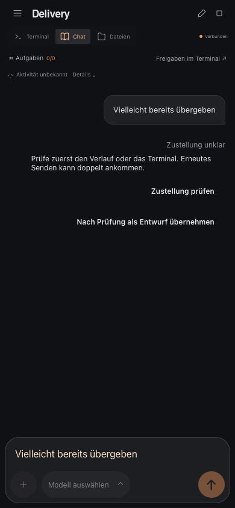

# Nachrichten auf dem Handy senden und wiederherstellen

Der Chat speichert Entwürfe und bereits hochgeladene Anhänge im Browser. Beim
Wiederöffnen derselben Sitzung stehen sie wieder bereit. Ein anderer Account oder
eine andere Sitzung erhält einen getrennten Entwurf. Browserdaten sind an die
Adresse gebunden: localhost und die mobile HTTPS-Adresse teilen keinen Speicher.

Nach dem Senden erscheint die Nachricht sofort im Verlauf. Ihr Status zeigt:

- **Wartet auf Übergabe:** lokal gespeichert, noch nicht bestätigt angenommen.
- **Wird übergeben / Übergabe läuft:** ein Übergabeversuch ist aktiv.
- **An Sitzung übergeben:** die Terminal-Eingabe ist beendet. Das bestätigt noch
  keinen Bearbeitungsbeginn und auch keine interne Warteschlange des Providers.
- **Nicht übergeben:** die Sitzung oder eine Freigabe hat die Eingabe vor dem
  Schreiben abgelehnt. „Neu zustellen“ prüft einen weiteren Versuch; über
  „Nachricht bearbeiten“ wird sie wieder zum Entwurf.
- **Zustellung unklar:** die Eingabe könnte bereits erfolgt sein. Zuerst Verlauf
  oder Terminal prüfen. Nur bewusst als Entwurf übernehmen; erneutes Senden kann
  ansonsten dieselbe Arbeit noch einmal auslösen.

Beim Aufwachen oder Neuladen fragt der Chat den vorhandenen Zustellungsbeleg ab.
Er sendet dabei keine neue Eingabe. Wenn kein Beleg vorhanden ist, lässt sich die
Übergabe ausdrücklich erneut versuchen. Dieser Versuch verwendet dieselbe ID;
der Server führt einen bereits bekannten Auftrag nicht nochmals aus.

Die vorläufige Chatblase wird durch einen passenden neuen Eintrag aus dem
CLI-Verlauf ersetzt. Falls das CLI den Text verändert, bleibt die Übergabeanzeige
unter Umständen separat sichtbar und kann geschlossen werden. Dieser Textabgleich
ist ausschließlich eine Darstellungshilfe und entscheidet nicht über Wiederholung.

## Direkte Übergabe und erneutes Zustellen

Codex, Claude und OpenCode erhalten Chatnachrichten direkt in ihrer laufenden TUI.
Der Terminal-Tab muss dafür nicht geöffnet sein. Die CLI entscheidet, wie Eingaben
während einer laufenden Aufgabe eingereiht oder verarbeitet werden. AgentPier prüft
vorher die Sitzung, offene Dialoge und das native Eingabefeld. Andere vorhandene
Entwürfe werden nicht gelöscht oder mit der Chatnachricht vermischt.

Fehlgeschlagene und unklare Nachrichten behalten ihren Text und ihre Anhänge, auch
wenn später weitere Nachrichten gesendet werden. **Neu zustellen** prüft zuerst
unter der Sitzungssperre, was bereits geschrieben wurde:

- Wurde noch nichts geschrieben und ist das Eingabefeld frei, wird die Nachricht
  einmal eingefügt und abgeschickt.
- Steht der vollständige eigene Text noch unverändert im Eingabefeld und hat der
  ursprüngliche Versuch noch keinen Submit begonnen, wird nur das Abschicken nachgeholt.
- Bei anderem oder nur teilweise erkennbarem Text, einer geänderten CLI-Sitzung
  oder einem möglicherweise schon erfolgten Submit bleibt die Eingabe unverändert.
  Der Chat zeigt den Grund und bietet **TUI öffnen** an.

Lange, umgebrochene oder eingeklappte native Entwürfe lassen sich derzeit nicht
zuverlässig vollständig zurücklesen und werden bei Wiederzustellung nicht als
exakter Treffer behandelt. Auch ältere Belege ohne Schreibjournal liefern keinen
Nachweis für einen sicheren erneuten Versuch. Die Erkennung ist mit den unter
[Native Validierung](direct-chat-tui-validation.md) genannten Versionen und
Standarddarstellungen geprüft; unbekannte Layouts werden vor der Eingabe abgelehnt.

Ein Verbindungsabbruch oder erneutes Öffnen des Chats sendet nichts automatisch.
Ein Doppelklick oder wiederholter HTTP-Aufruf mit derselben Versuchs-ID führt den
Versuch nicht erneut aus. **Übergabe prüfen** bei einer bereits übergebenen Nachricht
liest nur den Zustand. Fehlende KI-Ausgabe allein beweist keinen Zustellfehler.
Gleichzeitiges Tippen außerhalb AgentPiers, etwa über einen eigenen tmux-Client,
kann AgentPier nicht unter seiner internen Sitzungssperre koordinieren.

## Slash-Befehle

Einzeilige Slash-Befehle wie `/clear`, `/new`, `/compact` oder `/model` werden bei
Codex, Claude und OpenCode direkt an die TUI übergeben. Ob ein Befehl verfügbar
ist und wann er ausgeführt werden darf, entscheidet die jeweilige CLI. Dialoge
und Rückfragen lassen sich im Terminal bedienen. Beispielsweise erlaubt Codex
`/clear` erst, wenn die laufende Aufgabe beendet ist. Der Chat verwirft den alten
Verlauf erst, wenn die CLI die neue Unterhaltung meldet. Auch für Slash-Befehle
verhindert derselbe Zustellungsbeleg eine doppelte Übergabe.

## Speicherung und Grenzen

Fertige Uploads werden als Dateiname und Pfad wiederhergestellt. Lokale Vorschaudaten
werden nicht dauerhaft gespeichert; nach Neuladen bleibt der Dateiname sichtbar.
Ein unterbrochener, noch nicht bestätigter Upload muss erneut ausgewählt werden.
Gelöschte Dateien werden dadurch nicht wiederhergestellt.

Web Locks verhindert, dass zwei Tabs ihre ausstehenden Aufträge gegenseitig
überschreiben. Aktuelle Browser mit Web Locks und nutzbarem lokalem Speicher sind
für den geschützten Versand erforderlich. Speicherprobleme erscheinen als Fehler;
ohne gespeicherten Auftrag startet der Chat keinen neuen Übergabeversuch.

Browserdaten löschen entfernt auch Entwürfe und lokale Übergabeanzeigen. Der
Server behält private Belege ohne Nachrichtentext bis zum Löschen der Sitzung.
Die Garantie setzt wie bisher eine einzelne AgentPier-Instanz pro Datenverzeichnis
voraus. Ein erfolgreicher Beleg ist keine Bestätigung des KI-Providers.

