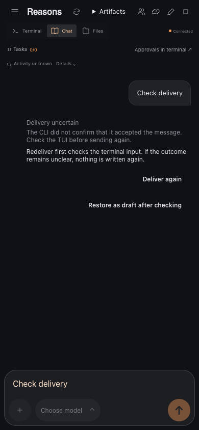

# Codex and OpenCode chat prompt guards

The chat handoff uses native prompt adapters for Codex and OpenCode as well as
Claude. Messages wait in the existing per-session FIFO while a recognized native
menu or permission dialog is open. The adapter never answers or dismisses these
Codex/OpenCode dialogs. Closing or answering one in the terminal releases the
message automatically; a message already pasted receives only its missing Enter,
and only while its proven prompt is unchanged.

A recognized draft is cleared using Ctrl-E/Ctrl-U, Backspace and, if needed,
Delete, with bounded attempts and fresh observations between keys. Clearing never
uses Escape or Ctrl-C. If clearing stalls, text is appended on a separate line
with the existing informational notice. Unsupported layouts retain the existing
explicit-send fallback and its unreadable-prompt notice; this does not claim
protection against every possible native dialog, theme or future CLI version.

Before Enter, a readable prompt must contain a draft; a prompt that remains empty
after the paste produces `CHAT_SUBMIT_UNCONFIRMED` without Enter. After Enter, a
readable prompt must empty (or a slash command open a dialog), otherwise the
receipt is uncertain. Handoff confirmation is distinct from native-history
consumption and never proves the agent completed the task. A lost or unrendered
paste is never compensated with a second paste or Enter.

## Reproducible native spike

The probe uses a disposable application, HOME/config/data directories, isolated
native bindings, a private tmux socket and a loopback mock provider. The permission
case requests only `printf AP_PROBE_PERMISSION`, and the probe simulates the user
rejecting it; the delivery adapter never sends that answer. The mock's tool-call
mode is opt-in via `--prompt-spike`. No user sessions or provider credentials are
used.

```sh
node scripts/probe-chat-tui.mjs --native --tool codex --local-mock --http --bound --prompt-spike --samples 1
node scripts/probe-chat-tui.mjs --native --tool opencode --local-mock --http --bound --prompt-spike --samples 1
```

Validated on macOS arm64 with Codex 0.156.1 and OpenCode 1.18.32. The retained
native frames in `tests/fixtures/tui-input/*-prompt-spike.json` cover the prompt,
short/multiline/wrapped or collapsed drafts, model pickers and permission prompts.
The HTTP probe checks model menus and permissions at 120×35, 50×34 and 36×12,
including replay while held and one provider request after the user responds.
OpenCode clips the permission footer in the smallest pane; the native permission
panel heading still identifies the dialog. Active prompt geometry takes precedence
over older permission output in the conversation.

The normal bound native probe also covers queuing during an active turn, exact
multiline/long payloads, recovery without repasting, replay without duplicate writes,
replacement of a leftover draft and terminal-to-chat input. Unit/integration tests
cover lost pastes, stuck submits, dialogs arriving after paste, changed held drafts,
blank/indented Codex continuation rows and wrapped Codex prompt proofs. English
browser tests cover the provider-neutral delivery explanations.

## Limits

OpenCode's collapsed paste labels do not prove the full text behind them. An
interrupted delivery without an exact readable prompt remains uncertain instead
of automatically pressing Enter. Resizing a held prompt can invalidate its proof.

## Image preparation

The native spike compared text-first and image-first combined pastes with separate
image-path and text pastes. Both CLIs sent zero image parts for either combined
paste, but one image part for the separated paste. Merely moving the path before
the text is insufficient.

Codex and OpenCode now paste each existing absolute image path separately, wait
for its native chip, then paste the remaining text and press Enter once. The bound
HTTP probe delivered seven 1536×1024 PNGs per message to the local provider with
eight pastes and one Enter on both CLIs, including filenames containing spaces.
Codex paths are quoted so its native paste parser treats the entire path as one
image; OpenCode accepts the whole unquoted path. Claude retains its validated batch of
image paths followed by text.

An interrupted partial image batch stays uncertain and is never replayed. Once
all paths were pasted, the durable `images-pasted` phase can resume only the text
when the complete native chips still match. After `pasted`, recovery submits the
existing chips and text without another paste. Tests cover both phases, partial
batches, image-only messages and a text paste lost after the chips. A lost text
paste never submits the chips alone. Missing/unconfirmed chips keep the existing
informational notice; native history remains separate acceptance evidence.


