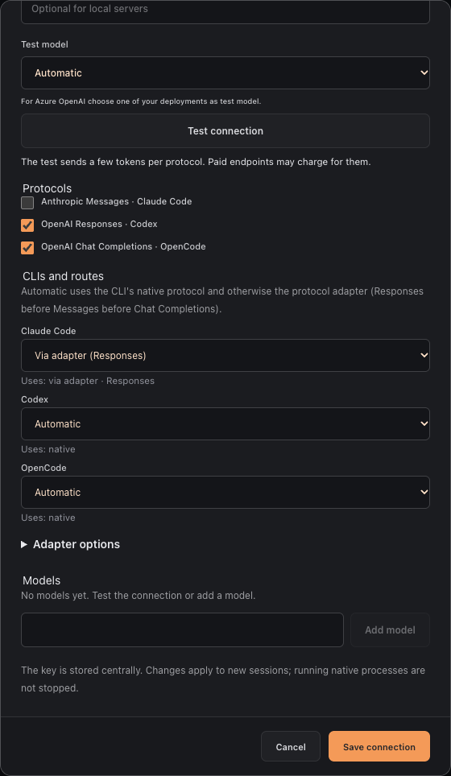
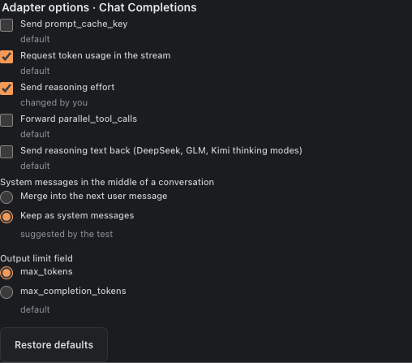
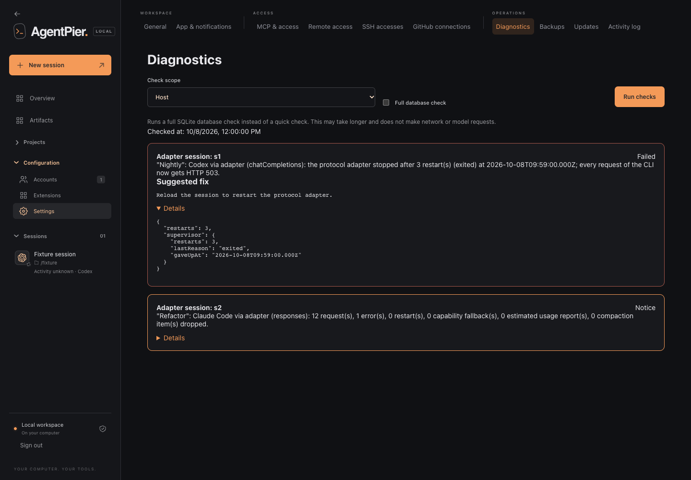

# Provider connections and native accounts

Configure shared OpenRouter or Z.ai access once, then choose the CLI and model for each new session. Native accounts remain specific to their CLI, and existing account-bound provider configurations remain supported.

## Central connections and session selection

Create a provider connection once, then select the CLI, compatible access and model when starting a session. A native account belongs to its own CLI; a central OpenRouter or Z.ai connection can be used across supported CLIs. Z.ai/Codex requires explicit Responses API access. Native defaults and existing account-specific provider profiles remain available.

Central keys are stored once. AgentPier creates an isolated managed profile for each connection/source account/CLI/model selection and keeps that identity for history after restart. Rotation affects future launches; deleting a connection prevents new launches while retaining existing session history. Native configuration, plugins and MCP settings are not copied into these profiles. AgentPier prepares its own Memory, AgentBus, GitHub and request integrations through the shared session lifecycle.

The API and internal boundary are documented in [provider-connections-design.md](refactor/provider-connections-design.md). Default backups retain connection metadata; encrypted credential backups also include the central key. A restore without credentials requires adding the key again.

Create the connection through `POST /api/provider-connections`:

```json
{
  "name": "Shared OpenRouter",
  "providerId": "openrouter",
  "apiKey": "<private API key>"
}
```

Then start a session with the returned opaque connection ID:

```json
{
  "tool": "opencode",
  "providerConnectionId": "<connection ID>",
  "providerModelId": "anthropic/claude-sonnet-4.6",
  "cwd": "/absolute/project/path"
}
```

A native session instead selects `{ "tool": "claude", "accountId": "local-claude" }`; optional `nativeModelId` pins an exact native model for that session. Native and provider model fields cannot be combined. Omitting a native model preserves the CLI default.

For central connections, provider identity is immutable. PATCH can rename the connection, rotate its key, remove it explicitly with `removeApiKey:true`, or update the Z.ai Responses entitlement declaration. An omitted/blank key preserves the saved key. Key updates affect future launches; running processes retain their launch environment. These semantics differ from the legacy account-specific mutation restrictions below.

## Custom endpoints

A custom endpoint connection points the CLIs at your own model server. Presets fill
defaults for **Ollama** and **llama.cpp**; **Custom** covers any OpenAI- or
Anthropic-compatible server such as LM Studio, vLLM, LiteLLM or Azure OpenAI.



**Routes.** Every CLI can use a connection that enables at least one protocol. A CLI
talks to its native protocol directly; otherwise a local protocol adapter translates
(see [protocol-adapter.md](protocol-adapter.md) for internals).

| CLI         | Messages upstream              | Responses upstream             | Chat Completions upstream              |
| ----------- | ------------------------------ | ------------------------------ | -------------------------------------- |
| Claude Code | native                         | adapter (Messages ← Responses) | adapter (Messages ← Chat)              |
| Codex       | adapter (Responses ← Messages) | native                         | adapter (Responses ← Chat)             |
| OpenCode    | native SDK `@ai-sdk/anthropic` | native SDK `@ai-sdk/openai`    | native SDK `@ai-sdk/openai-compatible` |

Native URLs are `<Anthropic base URL>/v1/messages`, `<OpenAI base URL>/responses` and
`<OpenAI base URL>/chat/completions`.

**Routing.** Each CLI has a route: Automatic, Native, Via adapter (protocol) or Off.
OpenCode chooses among its built-in providers (Chat Completions, Responses, Messages)
and never needs the adapter. Automatic takes the native protocol when enabled, otherwise
the adapter from the first enabled of Responses, Messages, Chat Completions (OpenCode:
Chat Completions, Responses, Messages). The dialog shows the resolved route and why a
choice is unavailable. Running sessions keep the route they started with until a reload, which
warns first. A pipeline run freezes the connection, including each CLI's route, when it
starts; if the route changes during the run, its next stage launch is refused with a
request to start a new run. A new run takes the new route; saving the profile again is
not needed.

**Adapter options.** Servers differ in which optional request fields they accept. Each
connection stores options for the upstream protocol; the defaults suit most servers.

| Upstream  | Option                       | Default      | Effect                                                        |
| --------- | ---------------------------- | ------------ | ------------------------------------------------------------- |
| Messages  | prompt caching               | on           | automatic `cache_control` breakpoints                         |
| Messages  | thinking budget              | off          | effort-only thinking as `enabled` plus `budget_tokens`        |
| Responses | `prompt_cache_key`           | off          | send a cache key                                              |
| Responses | reasoning effort             | on           | send `reasoning` and request encrypted reasoning              |
| Responses | `parallel_tool_calls`        | off          | forward the setting                                           |
| Chat      | `prompt_cache_key`           | off          | send a cache key                                              |
| Chat      | token usage in the stream    | on           | `stream_options.include_usage`                                |
| Chat      | reasoning effort             | off          | send `reasoning_effort`                                       |
| Chat      | `parallel_tool_calls`        | off          | forward the setting                                           |
| Chat      | reasoning text back          | off          | echo `reasoning_content` (DeepSeek, GLM, Kimi thinking)       |
| Chat      | system messages mid-dialogue | merge        | `inline` keeps them as `system` messages (OpenAI, Azure)      |
| Chat      | output limit field           | `max_tokens` | `max_completion_tokens` for OpenAI and Azure reasoning models |

_Test connection_ sends one extra request per option and pre-fills its result; the dialog
marks values "suggested by the test" and "changed by you", and _Restore defaults_ resets
them. Nothing is saved before _Save connection_. At runtime, when the server rejects a
request with 400 or 422 naming one of these options, the adapter retries once with the
option changed and keeps the change for that session only if the retry succeeds.
_Read `<think>` tags as reasoning_ (Chat adapter routes only) extracts `<think>…</think>`
from the reply text as reasoning. Each model has an _Images_ setting (Automatic, Yes, No);
with No the adapter rejects image input.



**Labels.** The connection list, the launch dialog and the session header show "native",
"via adapter · <protocol>" or, for OpenCode, only the protocol. When a connection's route
for the CLI changed since a session started, the reload dialog shows the before and now
labels and warns that reasoning data of the earlier conversation is not carried over.


**Limits.**

- Adapter routes ignore upstream HTTP(S) proxies: endpoints reachable only through a
  proxy do not work. The CLI keeps its proxy settings, with `127.0.0.1,localhost` added
  to `NO_PROXY`.
- Request bodies up to 64 MiB are accepted.
- Hosted tools (web search and similar) are dropped on targets without them.
  `previous_response_id` is rejected.
- After 3 adapter restarts within 60 s the CLI gets HTTP 503 until the session is
  reloaded.
- With a custom auth header, OpenCode's Messages and Responses providers send a blank
  `Authorization` header next to it. Whether Azure OpenAI accepts this is unverified.

**Addresses.** Plain `http` is accepted only for loopback, private (RFC 1918, `fc00::/7`),
link-local and CGNAT/Tailscale (`100.64.0.0/10`) addresses; everything else needs
`https`. Unspecified, multicast and broadcast addresses and the deprecated IPv4-compatible
IPv6 range (`::a.b.c.d`) are always rejected. NAT64 (`64:ff9b::/96`) counts as public and
needs `https`. AgentPier checks the resolved address when testing and before launch; the
CLI resolves the host again when it connects.

**API key.** Optional. It is sent as `Authorization: Bearer <key>` unless an auth header
name is set under _Advanced_ (for example `api-key`; Claude Code 2.1.227 or later). The
key is bound to the connection's origins (scheme, host and port of both base URLs).
Changing any of them while a key is saved is rejected with HTTP 409 until you enter the
key again or remove it. A test with changed origins does not send the saved key.

**Test connection.** Reads the model list (10 s timeout) and sends one minimal request per
protocol (90 s each, 180 s in total). Only one test runs at a time. The result is a
proposal; nothing is saved until you save the connection. Failures carry a fixed reason
(for example `auth`, `notFound`, `modelNotFound`, `invalidResponse`, `network`, `http`)
plus optional warnings. Paid endpoints may charge for the few tokens used.

**Models and context.** Every model needs a context size before it can be launched.

- Ollama: the context comes from `num_ctx` when the model sets it. Otherwise Ollama sizes
  the context by available VRAM or `OLLAMA_CONTEXT_LENGTH`, which its API does not report;
  confirm a value yourself (the model maximum is shown only as a hint).
- llama.cpp: the loaded `n_ctx` is read from `/props`. In router mode only models that
  are already loaded are asked (with `autoload=false`); for the others the context comes
  from their `-c`/`--ctx-size` launch argument when the router reports it, otherwise
  enter it yourself. A test never makes the router load a model. Model IDs that are file paths are
  skipped; start `llama-server` with `--alias` or add the model manually.
- Azure OpenAI: use `https://<resource>.openai.azure.com/openai/v1` and add your
  deployment names as models; the model list shows base models, not deployments. For
  Azure OpenAI choose one of your deployments as test model.

Model changes inside a running endpoint session require a reload.

**Launch.** Claude Code needs 2.1.193 or later for custom model contexts; AgentPier sets
`CLAUDE_CODE_DISABLE_EXPERIMENTAL_BETAS=1` for endpoint launches. Codex receives a
provider named after the connection. Keys reach the CLI only through the child
environment.

**Backup and restore.** Endpoint connections are never flagged as needing a login, because
a backup cannot tell a keyed endpoint from a keyless one. If a formerly keyed endpoint is
restored from a backup without secrets, enter the key again.

**Doctor.** The diagnostics report per endpoint whether a key is configured, the last test
result, models without a context size and the route of each CLI. They also report one
entry per running adapter session: requests, errors, restarts, capability fallbacks,
estimated usage and dropped compaction items. An entry fails when the adapter gave up
after repeated crashes or failed to start. A failed start ends the session, so stopped
sessions are reported too while their latest launch failed within the last 24 hours.
Only counters and fixed values are read from the session's diagnostics file. The checks
make no network calls.



## Legacy account-specific provider configuration

Managed accounts can select OpenRouter, Z.ai API, or Z.ai Coding Plan for Codex, Claude Code, and OpenCode. Existing local accounts and managed accounts without a provider retain their native behavior. Provider profiles use isolated configuration directories beneath the account profile; switching from a native login does not reuse its cached login.

Create a managed account with a server-catalog model ID:

```json
{
  "name": "OpenRouter coding",
  "tool": "opencode",
  "apiKey": "<private API key>",
  "provider": {
    "id": "openrouter",
    "modelId": "anthropic/claude-sonnet-4.6"
  }
}
```

`provider.id` accepts `openrouter`, `zai`, or `zai-coding-plan`. The model ID is the upstream ID, without OpenCode's extra provider prefix. Account selection cannot specify context sizes, endpoint URLs, authentication names, or arbitrary model IDs for OpenRouter and Z.ai connections. Those values come from validated server metadata and native adapters.

For Codex with either Z.ai service, select the verified `glm-5.3` model and explicitly set `responsesAccess: true`. This is an assertion that the selected account can use Z.ai's Responses endpoint, not an automatic credential check. Z.ai documents different protocol access for some historical subscriptions. A Chat-Completions-only account cannot use Codex through this adapter. See the [verified compatibility research](research/provider-compatibility.md) for the provider's current entitlement caveat.

Rotate a key by updating `apiKey`. An omitted or empty key preserves the saved key. Remove it with `removeApiKey: true`; a provider account without a key remains editable but cannot launch or enter browser authentication. Rotating and removing in one request is invalid. Changing the provider requires a fresh key or explicit removal so that the previous provider's credential is never forwarded to another service. Set `provider: null` to return a managed account to its native provider; the same key-switch rule applies. The HTTP layer prevents mutations while an account has active sessions.

## Native configuration and context

| CLI         | OpenRouter                                                                                    | Z.ai services                                                | Endpoint                            |
| ----------- | --------------------------------------------------------------------------------------------- | ------------------------------------------------------------ | ----------------------------------- |
| Codex       | Responses endpoint, `OPENROUTER_API_KEY`, command authentication for native catalog discovery | Responses endpoint, `ZAI_API_KEY`, verified GLM catalog      | if the endpoint offers the protocol |
| Claude Code | Anthropic gateway endpoint and token authentication                                           | Z.ai Anthropic endpoint and token authentication             | if the endpoint offers the protocol |
| OpenCode    | Native `openrouter` adapter and `OPENROUTER_API_KEY`                                          | Native `zai` / `zai-coding-plan` adapter and `ZHIPU_API_KEY` | if the endpoint offers the protocol |

Only private secret storage and the child environment contain keys. Public account/catalog/session metadata, command arguments, and generated provider configuration contain no key values. Codex routing is pinned through native configuration overrides; OpenCode's launch config preserves its native adapter and merges with existing MCP/extension settings.

Context metadata separates the provider headline (`contextTokens`), routing limit (`routingContextTokens`), generated output limit (`outputTokens`), and the context budget configured for the CLI (`assumedContextTokens`). `contextStatus` describes configuration, not proof of an inference request. `effectiveModelId` starts as `null`; a launch request alone does not prove what a CLI actually used.

Codex with Z.ai uses the provider's 1,048,576-token metadata. OpenRouter Codex retains native catalog discovery and authentication while pinning `model_context_window` to the smaller validated model and routing limit, or the sole known limit. This startup override reports `contextStatus: "configured"` and requires a new session for model changes. If both limits are unknown, AgentPier leaves the native context window unchanged. OpenCode receives validated limits for the selected model without replacing its provider adapter. When a routing limit is smaller than a headline limit, the configured budget uses the smaller value.

Claude models retain native model handling; a supported 1M selection uses the `[1m]` modifier. AgentPier does not disable compaction to force arbitrary windows on recognized Claude models. Non-Claude model IDs use the documented custom-window correction and require Claude Code 2.1.193 or later. The configured window remains a local assumption: it does not increase server capacity. Claude's output budget is conservatively capped at 32,000 tokens or the provider's smaller output limit.

Claude role aliases and subagents are pinned to the selected provider model. GLM mappings are labeled with their actual model name. Anthropic does not support non-Claude models, although Z.ai and OpenRouter document these integrations. Sessions with a process-level context override report `modelChangeRequiresRestart: true`; select the new provider model when starting another session so its budget follows the model. Legacy profiles can also change their saved account model.

## Backend interfaces

`ProviderCatalog({ dataDir, fetchImpl? })` owns model metadata. It exposes:

- `providers()` for provider IDs, labels, and supported CLI names.
- `list({ providerId?, tool? })` for validated public model entries.
- `get(providerId, modelId, { tool? })` for a validated exact selection.
- `status()` for each catalog's source, timestamp, stale state, and safe error message.
- `await refresh(providerId)` returning `{ models, status }`.

Refresh requests use fixed public endpoints, no account credentials, a 15-second timeout, a bounded response, and disabled redirects. Only text models with tool support enter the coding catalog. Missing or invalid limits stay unknown. Successful responses are cached privately; failed refreshes preserve the previous catalog with a stale/error status. Bundled data is a dated fallback and starts stale. Refresh is not a model call and does not certify account access.

Create `ProviderConnections({ dataDir })`, then pass it and the shared catalog into `AccountStore({ dataDir, home, providerCatalog, providerConnections })`. `ProviderAccess({ accounts, connections, providerCatalog })` resolves native or central access before the shared session lifecycle prepares its integrations. The account store validates selections and automatically applies native adapters in `command()`. `prepareProviderLaunch(account, secret, launch, { root, catalog, cliVersion? })` is the underlying adapter boundary for isolated tests. Its return value preserves launch fields and adds public `.provider` metadata.

## Verification

Provider tests cover the nine CLI/service combinations, exact IDs/endpoints, entitlement and version restrictions, profile isolation, key rotation/removal, persistence, malformed metadata, and stale catalog behavior. Property checks use reproducible fast-check seeds. Tests parse generated TOML/JSON and require no real key or inference request.

During the initial provider research, Codex CLI 0.153.4 accepted isolated provider configuration arguments through `codex debug models --bundled` for all three services. That command skips refresh and returns the bundled catalog, so it does not verify custom-catalog loading or provider connectivity. Tests separately parse generated catalog JSON. `--strict-config` is not supported for the `debug` subcommand. Claude Code reported version 2.1.263 from an isolated temporary profile. OpenCode was not available in that initial research shell. A later isolated OpenCode 1.18.29 installation verified the native TUI/plugin request path without model turns; it did not establish provider inference access. See the [native request report](refactor/requests-report.md). Subsequent real checks with user-saved central keys are recorded in [live-provider-verification.md](research/live-provider-verification.md), including successful native replies and the regular Z.ai API balance rejection in OpenCode. Generated context metadata alone is not proof of maximum effective inference capacity.

The source links, model-context discrepancies, and exact third-party support boundaries are recorded in [provider-compatibility.md](research/provider-compatibility.md).
