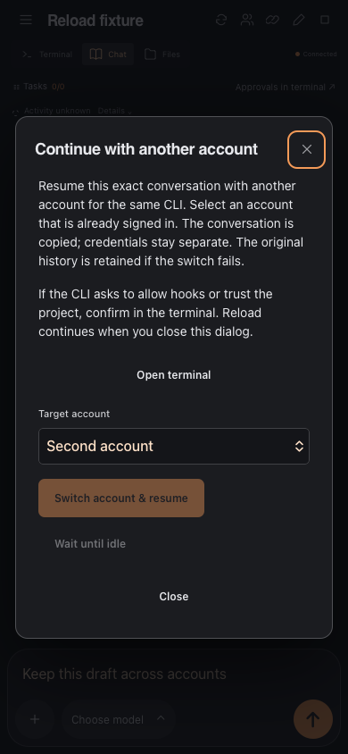

# Continue a session with another account

Use **Continue with another account** in the session header when you want to resume a conversation with another signed-in account. AgentPier supports Codex → Codex and Claude Code → Claude Code. Create and sign in to the target account under Accounts first.

Select the target account, then choose **Switch account & resume**, or queue the switch until the CLI is idle. Interrupting active work requires acknowledgment. Open the terminal if the CLI asks to approve hooks, trust the project, or sign in; closing the dialog does not cancel an in-progress switch.

The AgentPier session, native conversation ID, project directory, attachments, chat draft, delivery receipts and assigned hosts stay in place. Only this conversation's native files are copied into the target account's history. Claude's session-specific subagent files and rewind snapshots are included. Account credentials, account configuration, unrelated conversations and project files are not copied. The original history is retained.

If startup fails after switching, choose **Retry with current account**, or open **Reload & resume**. A server restart retains the failed operation for manual recovery. A queued switch retains its selected target and can be cancelled. Requests are idempotent; retrying an uncertain HTTP request does not restart twice.

A return to an earlier account is allowed when its stored conversation is unchanged or an older prefix of the current conversation. Divergent histories, links in history storage and a conversation already running in the target account are rejected. No histories are silently merged or overwritten with a different conversation.

The feature supports standalone local and managed CLI accounts. Pipeline, login, imported history-only and provider-connection sessions are excluded. OpenCode and cross-CLI transfers are not supported. Codex supports complete native JSONL rollouts in both `legacy` and `paginated` storage. Paginated rollouts retain their format and must have a matching storage marker and a complete ordinal sequence starting at zero. Codex rebuilds its SQLite history projection from the copied rollout on resume; account databases are not copied. Incomplete rollouts and unknown storage formats are rejected before the source process is stopped, and completeness is checked again after stopping. Authentication and remaining quota are enforced by the native CLI; AgentPier does not automatically rotate accounts or replay a failed prompt.

Validation includes isolated account/HTTP/tmux lifecycle tests for both CLIs, failure recovery, a concurrent target-session regression, filesystem isolation tests and Chromium/WebKit browser tests. An offline integration check with installed Codex 0.153.4 also verifies native resume of a copied paginated conversation under its unchanged UUID in a fresh account home, identical restored turns and byte-for-byte transfer of the conversation including tool results. These checks do not make live model requests using real user accounts.

Run the optional native regression with an installed Codex binary:

```sh
AGENTPIER_TEST_CODEX_BIN="$(command -v codex)" node --test tests/integration/codex-account-transfer-native.test.js
```

The native test creates disposable source and target profiles and uses a local dummy provider configuration without submitting a turn. It is skipped when `AGENTPIER_TEST_CODEX_BIN` is unset.


