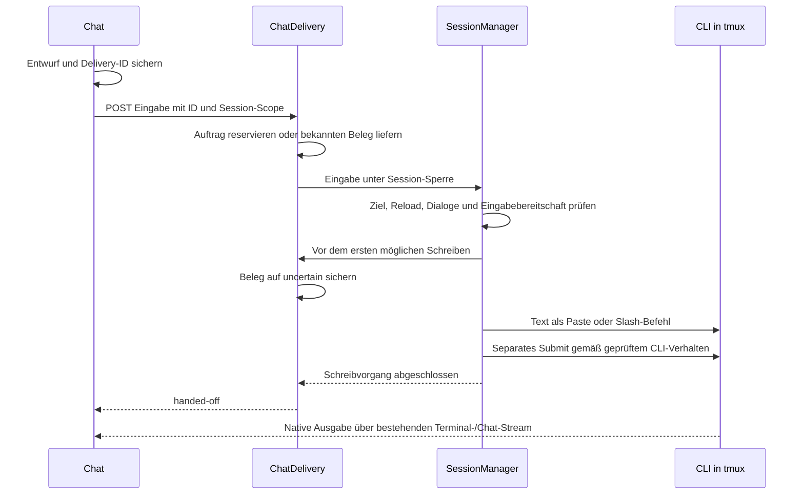

# Direkte Chat-Eingabe in die TUI

Status: Planungsentwurf, keine Implementierung oder Release-Freigabe.
Stand: 2026-09-11, Branch `fix/chat-slash-commands`, Commit `565def5`.

## Ziel

Nachrichten aus dem Chat sollen direkt in der laufenden Codex-, Claude- oder
OpenCode-TUI eingegeben und abgeschickt werden. Das soll auch während laufender
Aufgaben funktionieren, entsprechend der nativen Eingabe der jeweiligen CLI.
Die Übergabe darf nicht auf das Ende der Antwort oder das Laden des Chatverlaufs warten.

## Befund und Grenzen

- Der Browser sendet nach dauerhafter Entwurfssicherung sofort einen HTTP-Auftrag.
  Das 2,5-Sekunden-Polling prüft Zustellungsbelege; es steuert nicht das Absenden.
- `ChatDelivery.send` prüft den Auftrag und schreibt einen dauerhaften Beleg.
  Codex nutzt anschließend eine frische Thread-Zuordnung und `codex queue`;
  Claude und OpenCode nutzen bereits tmux-Paste plus Enter.
- PR #52 enthält direkte Slash-Befehle und getrennte Session-Warteschlangen.
  Diese Änderungen sind Voraussetzung und zum Planungszeitpunkt noch nicht released.
- Commit `05dd274` führte Codex-Queue als Fehlerbehebung ein. Ein bloßes Entfernen
  dieses Wegs könnte frühere Probleme wiederherstellen.
- Die gemeldeten Sekunden bis zur Anzeige in der TUI sind noch nicht einer einzigen
  Phase zugeordnet. Weniger Übergabeschritte sind keine gemessene Latenzgarantie.
- Synthetische Programme im echten tmux beweisen Byte-Transport, aber nicht die
  Eingabeverarbeitung oder Warteschlange echter Coding-CLIs.

## Varianten und Entscheidung

| Variante                                             | Vorteil                                                                                                 | Nachteil                                                                           | Entscheidung                     |
| ---------------------------------------------------- | ------------------------------------------------------------------------------------------------------- | ---------------------------------------------------------------------------------- | -------------------------------- |
| HTTP-Auftrag mit direkter serverseitiger TUI-Eingabe | Bestehende Belege, Authentisierung und Wiederherstellung; kein zusätzlicher Codex-Prozess pro Nachricht | Native Eingabe einschließlich Busy-Zustand muss je CLI geprüft werden              | Empfohlen                        |
| Browser schreibt direkt auf den Terminal-WebSocket   | Nutzt den Terminal-Kanal                                                                                | Chat müsste Belege, Wiederholungsregeln und Freigabeprüfungen dort erneut aufbauen | Nicht vorgesehen                 |
| Provider-Queue plus TUI-Fallback                     | Erhält Codex-Queue                                                                                      | Zwei Zustellungswege; Fallback nach unklarem Schreiben kann doppelt senden         | Nicht als automatischer Fallback |

## Ablauf

Der Terminal-Tab muss dafür weder geöffnet sein noch eine Browser-PTY-Verbindung
besitzen. Ziel bleibt die serverseitig verwaltete tmux-Pane der Session.

## Übergabevertrag

1. Genau ein aktiver Übergabeversuch je Nachricht. Der erste Auftrag und jeder
   ausdrücklich angeforderte Wiederherstellungsversuch haben eine eigene stabile ID.
   Jede Versuchs-ID wird höchstens einmal ausgeführt; HTTP-Replays starten keinen
   neuen Versuch. Das garantiert keine exakt einmal ausgeführte KI-Aufgabe.
2. `handed-off` bedeutet abgeschlossener Terminal-Schreibvorgang. Es behauptet
   weder sichtbare Anzeige noch Übernahme in eine Provider-Queue oder Antwortbeginn.
3. Vor dem ersten möglichen Schreiben wird `uncertain` dauerhaft gesichert.
   Fehler bei Paste, Submit, Prozessende oder Abschlussbeleg führen niemals zu
   automatischem Wiederholen oder Umschalten auf `codex queue`.
4. Account-/Session-Scope, Reload-Sperren, laufender Status, Request- und
   Modell-Dialogprüfungen bleiben erhalten und werden unter der Session-Sperre
   unmittelbar vor dem Schreiben erneut geprüft.
5. FIFO innerhalb einer Session; unabhängige Sessions können weiterarbeiten.
   Erstellen/Ersetzen behalten die exklusiven Barrieren aus PR #52.
6. `/clear` und `/new` löschen die Chatansicht erst nach gemeldetem Wechsel der
   nativen Unterhaltung. Das Absenden allein ist kein Reset-Signal.

## Native Eingabe und Konflikte

- Normale Nachrichten: vollständiger Text über einen eindeutigen tmux-Puffer und
  Bracketed Paste; danach ein separater Submit-Schritt. Keine Eingabe Zeichen für
  Zeichen, keine Interpretation des Nachrichtentextes als Tastennamen.
- Slash-Befehle: vorhandene Erkennung und literal eingegebener Befehl bleiben
  erhalten. Mehrzeilige Texte mit führendem Slash bleiben normale Prompts.
- Die bestehenden 250 ms für Codex-Slash-Befehle werden nicht blind entfernt.
  Für normale Prompts wird eine nötige Trennung von Paste und Submit zunächst an
  der echten CLI ermittelt. Keine pauschale mehrsekündige Wartezeit.
- Laufende Aufgabe: sofort an den nachweislich empfangsbereiten nativen Composer
  übergeben. Ob Enter dort einreiht oder steuert, ist je CLI zu dokumentieren.
  Kein Warten auf Task-Ende in einer neuen AgentPier-Warteschlange.
- Vorhandener TUI-Entwurf: niemals mit Ctrl+U löschen oder unbemerkt mit der
  Chatnachricht vermischen. Adapter muss einen belegten Composer vor der Übergabe
  erkennen und ablehnen. Ausnahme ist die unten beschriebene geprüfte Wiederherstellung
  des eigenen, vollständig eingefügten und noch nicht abgeschickten Textes.
  Bei nicht zuverlässig erkennbarer Eingabebereitschaft
  bleibt die Freigabe für diese CLI blockiert, statt eine leere Eingabe zu behaupten.
- Offene native Dialoge bleiben in der TUI bedienbar. Chat zeigt die bestehende
  Ablehnung mit einem konkreten Hinweis. Neue Meldungen werden deutsch/englisch ergänzt.
- Chattexte normalisieren CRLF und CR zu LF. Tab und LF sind erlaubt; andere C0-,
  DEL- und C1-Steuerzeichen werden vor dem Schreiben abgelehnt. Insbesondere darf
  eingebettetes ESC keine Bracketed-Paste-Grenze oder Steuertaste einschleusen.
  Rohe Terminal-Tastatureingaben behalten ihren eigenen bestehenden Vertrag.
- Schreibvorgänge über AgentPier werden gemeinsam serialisiert. Unabhängige
  externe tmux-/SSH-Eingaben lassen sich dadurch nicht atomar sperren; paralleles
  Tippen außerhalb AgentPiers bleibt eine ausdrücklich dokumentierte Grenze.

## Fehlermarkierung und „Neu zustellen“

Fehlgeschlagene Nachrichten bleiben als Chatblase mit erhaltenem Text sichtbar:
**„Nicht zugestellt“** bei sicher abgelehnter Übergabe und **„Zustellung unklar“**
bei möglicherweise schon erfolgtem Schreiben. Beide zeigen **„Neu zustellen“**.
Der Klick startet zuerst die serverseitige Prüfung und zeigt **„Wird geprüft …“**;
er bedeutet nicht automatisch erneutes Einfügen. Es gibt keine automatische
Wiederholung nach Timeout, Reload, Wiederverbindung oder CLI-Ausgabeverzögerung.

Die Prüfung läuft unter derselben Session-Sperre wie Eingaben und vergleicht den
Originalauftrag, die aktuelle Session-/Account-/Prozessgeneration, den vollständigen
nativen Composer und belastbare Annahmeinformationen. Ein leerer Composer, ein
passender Text im Scrollback oder ein fehlender History-Eintrag beweisen allein
weder Erfolg noch Fehlschlag. Lange, umgebrochene oder eingeklappte Eingaben dürfen
nicht anhand eines sichtbaren Ausschnitts als vollständiger Treffer gelten.

| Prüfergebnis                                                                                                               | Aktion nach Klick                                                         |
| -------------------------------------------------------------------------------------------------------------------------- | ------------------------------------------------------------------------- |
| Ursprünglicher Versuch hat nachweislich noch nichts geschrieben; Composer leer und bereit                                  | Text einmal einfügen und abschicken                                       |
| Eigener vollständiger Text steht unverändert im Composer; zugehöriger Versuch hat nachweislich noch keinen Submit begonnen | Nur den fehlenden Submit ausführen, Text nicht erneut einfügen            |
| Native Annahme ist eindeutig dem Versuch zugeordnet                                                                        | Status korrigieren; keine Eingabe wiederholen                             |
| Anderer, bearbeiteter oder nur teilweise vorhandener Text                                                                  | Nichts verändern; Konflikt anzeigen und „TUI öffnen“ anbieten             |
| Submit könnte schon erfolgt sein, CLI-Zuordnung geändert oder Zustand nicht sicher lesbar                                  | „Zustellung unklar“ beibehalten, Grund anzeigen und „TUI öffnen“ anbieten |

Für diesen Nachweis erhält jeder neue Versuch ein dauerhaftes Schreibjournal:
`reserved → paste-intent → pasted → submit-intent → submitted`.
Die jeweilige Intent-Phase wird **vor** dem externen Schreibschritt gespeichert.
`pasted` bestätigt nur den abgeschlossenen Paste-Aufruf; die vollständige Eingabe
muss für einen Submit-only-Versuch zusätzlich frisch geprüft werden. Ein Crash
nach `submit-intent` bleibt unklar, auch wenn Enter möglicherweise noch nicht
geschrieben wurde. Alte Belege ohne Phasen liefern keinen nachträglich erfundenen
Nachweis. Ein Slash-Versuch verwendet dieselben Phasen für das literale Einfügen.

Wiederherstellung erhält eine neue `attemptId`, ist mit der ursprünglichen
`deliveryId` verknüpft und wird dauerhaft dedupliziert. Zwei Tabs dürfen dadurch
keinen parallelen Wiederholungsversuch starten. Vor der tatsächlichen Eingabe
werden Zustand und Guards erneut unter der Sperre geprüft; eine vorherige
Browser-Anzeige ist keine Freigabe. Ändert sich der Text, entsteht ein neuer
normaler Auftrag statt einer Wiederholung mit derselben ID.

Text und zugehörige Anhänge bleiben bis zur Auflösung im Browser wiederherstellbar.
Der Server speichert weiterhin keine Nachrichtentexte im Beleg: Vergleich über
den erneut übermittelten, gegen den ursprünglichen Hash geprüften Inhalt.
Journal, Versuchskette und aktuelle Auftragsentscheidung werden atomar aktualisiert.
Die UI zeigt das Ergebnis am ursprünglichen Auftrag, ohne eine zweite Chatblase
für einen bloßen Submit-only-Versuch anzulegen. Aktive Versuche deaktivieren den
Button; bestätigte Übergaben entfernen ihn. Bleibt nach einem Schreibbeleg die
Annahme fraglich, kann „Übergabe prüfen“ denselben Prüfweg ohne Schreibfreigabe
aufrufen. Sichtbare Wartezeit allein macht einen erfolgreichen Schreibbeleg nicht
automatisch zum Fehler.

## Messung und Abnahme

Die isolierte Teststrecke erfasst mit monotoner Uhr getrennt: Browser-Absenden,
HTTP-Eingang, Eintritt in die Session-Sperre, Beginn Paste, Ende Submit,
HTTP-Beleg und erstes sichtbares natives Echo. Über Prozessgrenzen werden nur
Intervalle derselben Uhr verglichen. Native Ausgabe wird über einen eindeutigen
synthetischen Marker zugeordnet, nicht über private Chattexte.

Lokales Ziel: bei unbelastetem Host p95 unter 500 ms von HTTP-Eingang bis Ende
Submit bei 30 kurzen Nachrichten je CLI; sichtbares Echo separat ausweisen.
Das ist ein zu überprüfendes Abnahmeziel, kein bereits belegter Wert und keine
harte CI-Zeitgrenze. Fremde blockierte Session darf die Übergabe nicht verzögern.

Verpflichtende Matrix für Codex, Claude und OpenCode:

| Zustand                                                                     | Erwartung                                                                      |
| --------------------------------------------------------------------------- | ------------------------------------------------------------------------------ |
| Idle, einfacher Text, Unicode, mehrzeilig, Dateipfade                       | Inhalt unverändert nach definierter Zeilenumbruch-Normalisierung, ein Submit   |
| Aufgabe läuft; mehrere aufeinanderfolgende Chatnachrichten                  | Native Annahme vor Aufgabenende; keine verlorenen oder vermischten Nachrichten |
| TUI-Entwurf oder Berechtigungs-/Modell-Dialog                               | Ablehnung vor dem ersten Byte, vorhandene Eingabe bleibt erhalten              |
| Reload, Accountwechsel, Prozessende                                         | Korrektes Ziel oder Ablehnung; kein Schreiben in Ersatzsession mit altem Scope |
| Replay, zwei Tabs, HTTP-Abbruch, Neustart nach Paste                        | Kein zweiter Schreibversuch; unklare Übergabe bleibt unklar                    |
| Slash-Befehl und anschließend neue Unterhaltung                             | Native Befehlsausführung; Chat folgt erst bestätigtem Identitätswechsel        |
| Terminal-Tab geschlossen                                                    | Eingabe funktioniert ohne Browser-Terminal-Verbindung                          |
| „Neu zustellen“, Text vollständig im Composer, Submit sicher nicht begonnen | Genau ein Submit, kein zweites Einfügen                                        |
| „Neu zustellen“, ursprünglicher Versuch sicher vor Schreiben abgelehnt      | Genau eine erneute Übergabe nach erneuter Prüfung                              |
| Retry-Doppelklick, zwei Tabs, Neustart in jeder Journalphase                | Ein aktiver Versuch; kein Wiederholen einer Versuchs-ID                        |
| Teiltext, bearbeiteter Text, unbekannter Submit oder veraltete Session      | Keine Veränderung der TUI, konkreter Konfliktstatus                            |

Automatisierte Tests nutzen ausschließlich temporäre Datenverzeichnisse und einen
privaten tmux-Server. Echte CLI-Abnahme nutzt ebenfalls frische Profile und ein
temporäres Projekt mit kontrolliertem Testprovider, soweit unterstützt. Fehlt
ein funktionierender Testzugang, wird diese Abnahme als offen dokumentiert und die
Umstellung der betreffenden CLI nicht als produktionsreif bezeichnet. Keine
Kopie privater Credentials und keine Testnachrichten in laufende Nutzersessions.

## Umfang und Auslieferung

Node.js 22.13+, macOS und Linux; keine neue Laufzeitabhängigkeit oder Broker.
HTTP-API und Zustellungsstatus werden für Prüfung und ausdrückliche Wiederherstellung
additiv erweitert; bestehende Aufträge und WebSocket-Ausgabekanäle bleiben kompatibel.
Source-/Testdateien bleiben unter 600 Zeilen. Profile und Belege brauchen keine Migration.

Umsetzung in einem eigenen Folge-PR auf dem integrierten Stand von PR #52.
Erst nach nativer Abnahme, Regressionstests, erforderlicher CI und aufgelösten
Review-Funden mergen. Ein Release ist ein späterer separater Schritt. Kein
stiller Rückfall auf einen zweiten Zustellungsweg bei Laufzeitfehlern.
